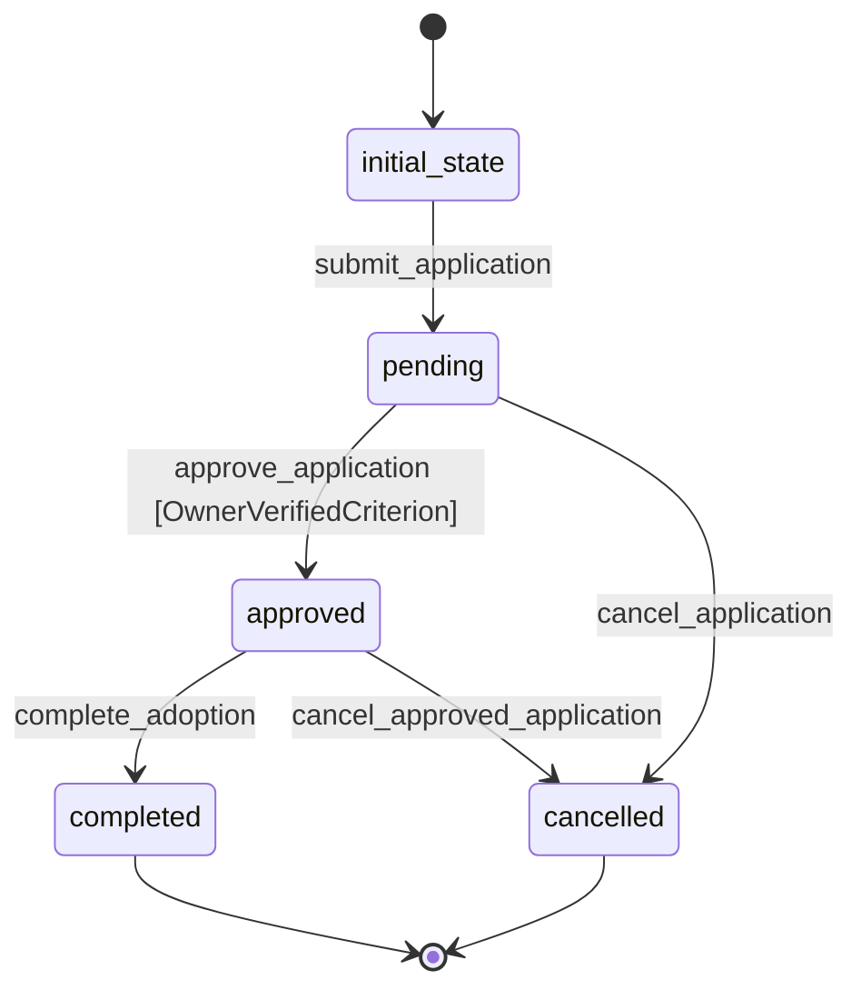

# Adoption Workflow

## States
- **initial_state**: Starting state for new adoption applications
- **pending**: Adoption application submitted and under review
- **approved**: Adoption application approved, awaiting completion
- **completed**: Adoption process completed successfully
- **cancelled**: Adoption process cancelled

## Transitions

### initial_state → pending
- **Name**: submit_application
- **Type**: Automatic
- **Processor**: SubmitApplicationProcessor
- **Purpose**: Submit new adoption application

### pending → approved
- **Name**: approve_application
- **Type**: Manual
- **Processor**: ApproveApplicationProcessor
- **Criterion**: OwnerVerifiedCriterion
- **Purpose**: Approve adoption application

### approved → completed
- **Name**: complete_adoption
- **Type**: Manual
- **Processor**: CompleteAdoptionProcessor
- **Purpose**: Finalize adoption process

### pending → cancelled
- **Name**: cancel_application
- **Type**: Manual
- **Processor**: CancelApplicationProcessor
- **Purpose**: Cancel adoption application

### approved → cancelled
- **Name**: cancel_approved_application
- **Type**: Manual
- **Processor**: CancelApplicationProcessor
- **Purpose**: Cancel approved adoption application

## Processors

### SubmitApplicationProcessor
- **Input**: Adoption entity with pet and owner references
- **Purpose**: Process new adoption application
- **Output**: Adoption application submitted for review
- **Pseudocode**:
```
process(entity):
    entity.application_date = current_timestamp()
    entity.status = "pending"
    reserve_pet(entity.pet_id)
    notify_staff_new_application(entity)
    return entity
```

### ApproveApplicationProcessor
- **Input**: Pending adoption entity
- **Purpose**: Approve adoption application
- **Output**: Adoption approved for completion
- **Pseudocode**:
```
process(entity):
    entity.approval_date = current_timestamp()
    entity.status = "approved"
    notify_owner_approval(entity.owner_id)
    return entity
```

### CompleteAdoptionProcessor
- **Input**: Approved adoption entity
- **Purpose**: Complete the adoption process
- **Output**: Adoption completed successfully
- **Pseudocode**:
```
process(entity):
    entity.adoption_date = current_timestamp()
    entity.status = "completed"
    finalize_pet_adoption(entity.pet_id, entity.owner_id)
    process_payment(entity.fee_paid)
    return entity
```

## Criteria

### OwnerVerifiedCriterion
- **Purpose**: Check if the adopting owner is verified
- **Pseudocode**:
```
check(entity):
    owner = get_owner(entity.owner_id)
    return owner.status == "verified" or owner.status == "active"
```

## Mermaid State Diagram

