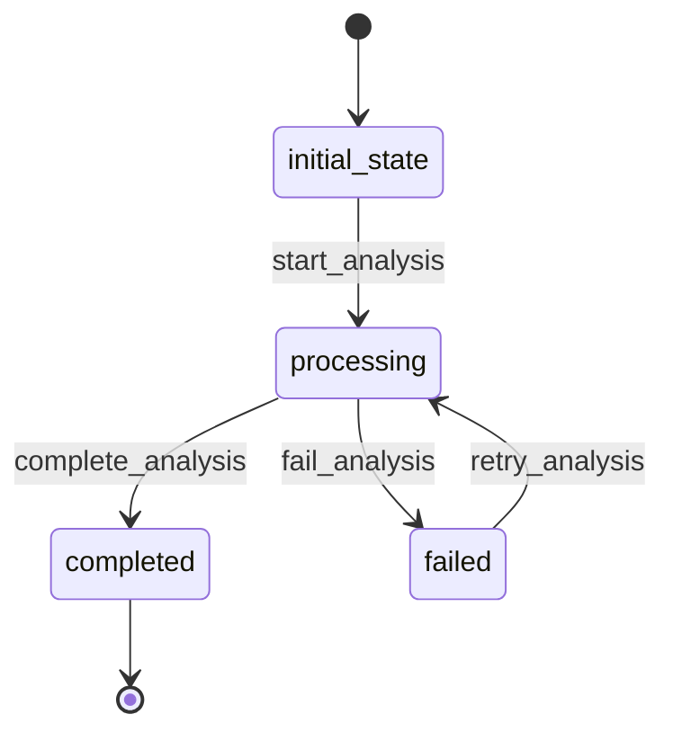

# Analysis Workflow

## Description
Workflow for processing comment analysis including sentiment analysis, keyword extraction, and toxicity detection.

## States
- **initial_state**: Starting point
- **processing**: Analysis is being performed
- **completed**: Analysis has been completed
- **failed**: Analysis failed and needs retry

## Transitions

### initial_state → processing
- **Name**: start_analysis
- **Type**: Automatic
- **Processor**: StartAnalysisProcessor
- **Description**: Begin analysis of the associated comment

### processing → completed
- **Name**: complete_analysis
- **Type**: Manual
- **Processor**: CompleteAnalysisProcessor
- **Criterion**: AnalysisSuccessfulCriterion
- **Description**: Complete analysis when successful

### processing → failed
- **Name**: fail_analysis
- **Type**: Manual
- **Criterion**: AnalysisFailedCriterion
- **Description**: Mark analysis as failed

### failed → processing
- **Name**: retry_analysis
- **Type**: Manual
- **Processor**: RetryAnalysisProcessor
- **Description**: Retry failed analysis

## Mermaid State Diagram


## Processors

### StartAnalysisProcessor
- **Entity**: Analysis
- **Input**: Analysis entity with comment reference
- **Purpose**: Initialize and perform comment analysis
- **Output**: Analysis entity with processing status
- **Pseudocode**:
```
process(entity):
    comment = get_comment_by_id(entity.comment_id)
    entity.sentiment_score = analyze_sentiment(comment.content)
    entity.sentiment_label = get_sentiment_label(entity.sentiment_score)
    entity.keywords = extract_keywords(comment.content)
    entity.language = detect_language(comment.content)
    entity.toxicity_score = analyze_toxicity(comment.content)
    entity.analyzed_at = current_timestamp()
    return entity
```

### CompleteAnalysisProcessor
- **Entity**: Analysis
- **Input**: Analysis with completed results
- **Purpose**: Finalize analysis and mark as complete
- **Output**: Completed analysis entity
- **Pseudocode**:
```
process(entity):
    entity.status = "completed"
    entity.completed_at = current_timestamp()
    return entity
```

### RetryAnalysisProcessor
- **Entity**: Analysis
- **Input**: Failed analysis entity
- **Purpose**: Reset analysis for retry
- **Output**: Analysis entity ready for retry
- **Pseudocode**:
```
process(entity):
    entity.status = "retrying"
    entity.retry_count = entity.retry_count + 1
    entity.last_retry_at = current_timestamp()
    return entity
```

## Criteria

### AnalysisSuccessfulCriterion
- **Purpose**: Check if analysis completed successfully
- **Pseudocode**:
```
check(entity):
    return entity.sentiment_score is not null and 
           entity.keywords is not null and 
           entity.language is not null and
           entity.toxicity_score is not null
```

### AnalysisFailedCriterion
- **Purpose**: Check if analysis failed
- **Pseudocode**:
```
check(entity):
    return entity.sentiment_score is null or 
           entity.keywords is null or 
           entity.language is null or
           entity.toxicity_score is null
```
