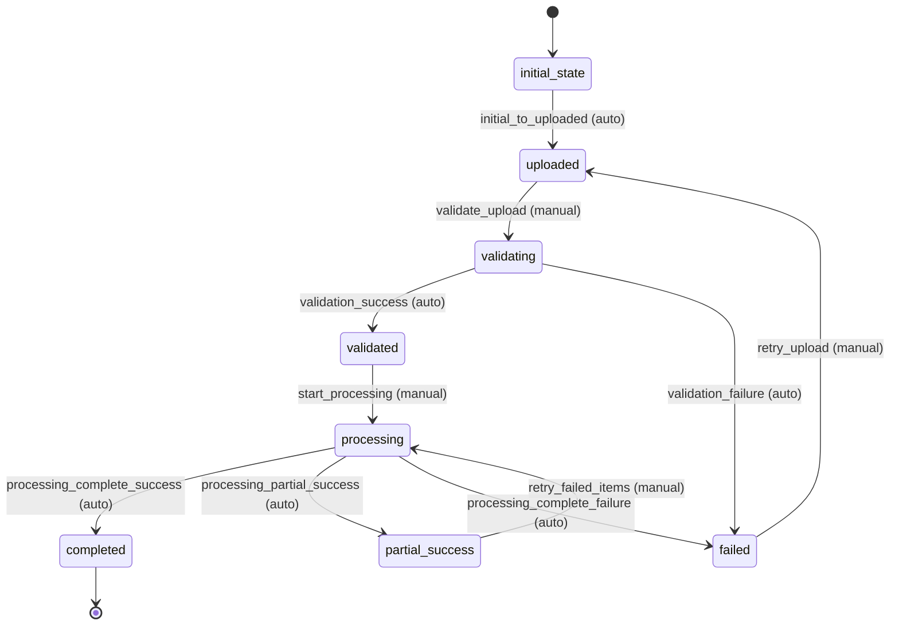

# Bulk Upload Workflow

## Overview
The Bulk Upload workflow manages the process of uploading and processing multiple Hacker News items from JSON files. It handles file validation, parsing, item processing, and collection creation.

## Workflow States

### 1. initial_state
- **Description**: Starting state for all new bulk uploads
- **Entry Condition**: Upload is initiated
- **Exit Condition**: Automatic transition to uploaded state

### 2. uploaded
- **Description**: File has been uploaded but not processed
- **Entry Condition**: File upload is complete
- **Exit Condition**: File is ready for validation

### 3. validating
- **Description**: File content and structure are being validated
- **Entry Condition**: Validation process starts
- **Exit Condition**: Validation completes successfully or fails

### 4. validated
- **Description**: File has been validated and is ready for processing
- **Entry Condition**: All validation checks pass
- **Exit Condition**: Processing can begin

### 5. processing
- **Description**: Items are being extracted and processed
- **Entry Condition**: Processing starts
- **Exit Condition**: All items processed or processing fails

### 6. completed
- **Description**: All items have been processed successfully
- **Entry Condition**: Processing completes without errors
- **Exit Condition**: Upload is finalized

### 7. partial_success
- **Description**: Some items processed successfully, some failed
- **Entry Condition**: Processing completes with some failures
- **Exit Condition**: Manual review or retry

### 8. failed
- **Description**: Upload processing failed completely
- **Entry Condition**: Critical failure during processing
- **Exit Condition**: Manual intervention or retry

## Workflow Transitions

### 1. initial_to_uploaded
- **From**: initial_state
- **To**: uploaded
- **Type**: Automatic
- **Trigger**: File upload completion
- **Processors**: None
- **Criteria**: None

### 2. validate_upload
- **From**: uploaded
- **To**: validating
- **Type**: Manual
- **Trigger**: Validation request
- **Processors**: validate_upload_processor
- **Criteria**: None

### 3. validation_success
- **From**: validating
- **To**: validated
- **Type**: Automatic
- **Trigger**: Validation completion
- **Processors**: None
- **Criteria**: validation_success_criterion

### 4. validation_failure
- **From**: validating
- **To**: failed
- **Type**: Automatic
- **Trigger**: Validation failure
- **Processors**: handle_validation_failure_processor
- **Criteria**: validation_failure_criterion

### 5. start_processing
- **From**: validated
- **To**: processing
- **Type**: Manual
- **Trigger**: Processing request
- **Processors**: start_processing_processor
- **Criteria**: None

### 6. processing_complete_success
- **From**: processing
- **To**: completed
- **Type**: Automatic
- **Trigger**: All items processed successfully
- **Processors**: finalize_success_processor
- **Criteria**: processing_complete_success_criterion

### 7. processing_partial_success
- **From**: processing
- **To**: partial_success
- **Type**: Automatic
- **Trigger**: Some items failed
- **Processors**: handle_partial_success_processor
- **Criteria**: processing_partial_success_criterion

### 8. processing_complete_failure
- **From**: processing
- **To**: failed
- **Type**: Automatic
- **Trigger**: Processing failed completely
- **Processors**: handle_processing_failure_processor
- **Criteria**: processing_complete_failure_criterion

### 9. retry_failed_items
- **From**: partial_success
- **To**: processing
- **Type**: Manual
- **Trigger**: Retry request
- **Processors**: retry_failed_items_processor
- **Criteria**: retry_allowed_criterion

### 10. retry_upload
- **From**: failed
- **To**: uploaded
- **Type**: Manual
- **Trigger**: Retry request
- **Processors**: reset_upload_processor
- **Criteria**: retry_allowed_criterion

## Workflow Diagram



## Processors

### 1. validate_upload_processor
- **Entity**: BulkUpload
- **Purpose**: Validate uploaded file format, structure, and content
- **Input**: Upload entity with file information
- **Output**: Entity with validation results
- **Pseudocode**:
```
process(entity):
    validation_errors = []
    
    // Validate file format
    if not is_valid_json_file(entity.filename):
        validation_errors.append("Invalid file format - must be JSON")
    
    // Validate file size
    if entity.file_size > MAX_FILE_SIZE:
        validation_errors.append(f"File too large - max size is {MAX_FILE_SIZE}")
    
    // Parse and validate content structure
    try:
        content = parse_json_file(entity.filename)
        if not isinstance(content, list):
            if not isinstance(content, dict):
                validation_errors.append("File must contain JSON array or object")
            else:
                content = [content]  // Convert single object to array
        
        // Validate each item structure
        for i, item in enumerate(content):
            item_errors = validate_hn_item_structure(item)
            if item_errors:
                validation_errors.extend([f"Item {i}: {error}" for error in item_errors])
        
        entity.total_items = len(content)
        entity.parsed_content = content
        
    except Exception as e:
        validation_errors.append(f"JSON parsing error: {str(e)}")
    
    entity.validation_errors = validation_errors
    entity.validation_status = "passed" if not validation_errors else "failed"
    entity.validated_at = current_timestamp()
    
    return entity
```

### 2. handle_validation_failure_processor
- **Entity**: BulkUpload
- **Purpose**: Handle validation failures
- **Input**: Entity with validation errors
- **Output**: Entity with failure handling
- **Pseudocode**:
```
process(entity):
    entity.failure_reason = "validation_failed"
    entity.failure_details = entity.validation_errors
    entity.failed_at = current_timestamp()
    
    log_error(f"Bulk upload {entity.upload_id} validation failed", entity.validation_errors)
    
    return entity
```

### 3. start_processing_processor
- **Entity**: BulkUpload
- **Purpose**: Initialize processing of validated items
- **Input**: Validated upload entity
- **Output**: Entity ready for processing
- **Pseudocode**:
```
process(entity):
    entity.started_at = current_timestamp()
    entity.processed_items = 0
    entity.failed_items = 0
    entity.processing_errors = []
    
    // Create collection for processed items
    collection_id = create_collection_for_upload(entity)
    entity.collection_id = collection_id
    
    // Initialize processing progress
    entity.processing_progress = {
        "total": entity.total_items,
        "processed": 0,
        "failed": 0,
        "current_item": 0
    }
    
    return entity
```

### 4. finalize_success_processor
- **Entity**: BulkUpload
- **Purpose**: Finalize successful processing
- **Input**: Successfully processed upload
- **Output**: Completed upload entity
- **Pseudocode**:
```
process(entity):
    entity.completed_at = current_timestamp()
    entity.processing_time = entity.completed_at - entity.started_at
    
    // Finalize collection
    finalize_collection(entity.collection_id)
    
    // Generate processing report
    entity.processing_report = {
        "total_items": entity.total_items,
        "processed_items": entity.processed_items,
        "failed_items": entity.failed_items,
        "success_rate": (entity.processed_items / entity.total_items) * 100,
        "processing_time_ms": entity.processing_time
    }
    
    // Cleanup temporary files
    cleanup_temp_files(entity)
    
    return entity
```

### 5. handle_partial_success_processor
- **Entity**: BulkUpload
- **Purpose**: Handle partial success scenarios
- **Input**: Partially processed upload
- **Output**: Entity with partial success handling
- **Pseudocode**:
```
process(entity):
    entity.partial_completed_at = current_timestamp()
    
    // Generate detailed error report
    entity.failure_report = {
        "failed_items": entity.failed_items,
        "processing_errors": entity.processing_errors,
        "success_rate": (entity.processed_items / entity.total_items) * 100
    }
    
    // Update collection with successfully processed items
    update_collection_with_processed_items(entity.collection_id, entity.processed_items)
    
    log_warning(f"Bulk upload {entity.upload_id} partially successful", entity.failure_report)
    
    return entity
```

### 6. handle_processing_failure_processor
- **Entity**: BulkUpload
- **Purpose**: Handle complete processing failure
- **Input**: Failed upload entity
- **Output**: Entity with failure handling
- **Pseudocode**:
```
process(entity):
    entity.failure_reason = "processing_failed"
    entity.failed_at = current_timestamp()
    
    // Cleanup any partially created items
    cleanup_partial_items(entity.collection_id)
    
    // Remove failed collection
    if entity.collection_id:
        delete_collection(entity.collection_id)
        entity.collection_id = None
    
    log_error(f"Bulk upload {entity.upload_id} processing failed completely", entity.processing_errors)
    
    return entity
```

### 7. retry_failed_items_processor
- **Entity**: BulkUpload
- **Purpose**: Retry processing of failed items
- **Input**: Partially successful upload
- **Output**: Entity ready for retry processing
- **Pseudocode**:
```
process(entity):
    // Reset failed item counters
    entity.retry_count = entity.retry_count + 1 if entity.retry_count else 1
    entity.retry_started_at = current_timestamp()
    
    // Prepare failed items for retry
    failed_items = extract_failed_items(entity)
    entity.retry_items = failed_items
    entity.retry_total = len(failed_items)
    
    // Reset processing counters for retry
    entity.processing_errors = []
    
    return entity
```

### 8. reset_upload_processor
- **Entity**: BulkUpload
- **Purpose**: Reset upload for complete retry
- **Input**: Failed upload entity
- **Output**: Reset upload entity
- **Pseudocode**:
```
process(entity):
    // Clear all processing data
    entity.validation_errors = []
    entity.processing_errors = []
    entity.failure_reason = None
    entity.failure_details = None
    
    // Reset counters
    entity.processed_items = 0
    entity.failed_items = 0
    entity.validation_status = None
    
    // Update retry information
    entity.retry_count = entity.retry_count + 1 if entity.retry_count else 1
    entity.reset_at = current_timestamp()
    
    return entity
```

## Criteria

### 1. validation_success_criterion
- **Purpose**: Check if validation was successful
- **Pseudocode**:
```
check(entity):
    return (entity.validation_status == "passed" and 
            not entity.validation_errors and
            entity.total_items > 0)
```

### 2. validation_failure_criterion
- **Purpose**: Check if validation failed
- **Pseudocode**:
```
check(entity):
    return (entity.validation_status == "failed" or 
            entity.validation_errors)
```

### 3. processing_complete_success_criterion
- **Purpose**: Check if processing completed successfully
- **Pseudocode**:
```
check(entity):
    return (entity.processed_items == entity.total_items and 
            entity.failed_items == 0)
```

### 4. processing_partial_success_criterion
- **Purpose**: Check if processing had partial success
- **Pseudocode**:
```
check(entity):
    return (entity.processed_items > 0 and 
            entity.failed_items > 0 and
            entity.processed_items + entity.failed_items == entity.total_items)
```

### 5. processing_complete_failure_criterion
- **Purpose**: Check if processing failed completely
- **Pseudocode**:
```
check(entity):
    return (entity.processed_items == 0 and 
            entity.failed_items > 0)
```

### 6. retry_allowed_criterion
- **Purpose**: Check if retry is allowed
- **Pseudocode**:
```
check(entity):
    max_retries = 3
    retry_count = entity.retry_count or 0
    return retry_count < max_retries
```
