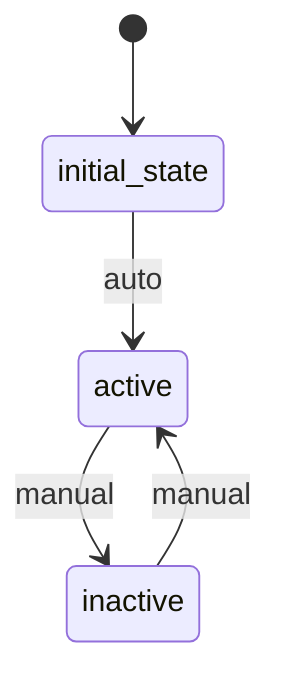

# Category Workflow

## States
- **initial_state**: Starting state
- **active**: Category is active and visible
- **inactive**: Category is inactive and hidden

## Transitions
- **initial_state → active**: Automatic transition when category created
- **active → inactive**: Manual transition to deactivate category
- **inactive → active**: Manual transition to reactivate category

## Processors

### ValidateCategoryInfo
- **Entity**: Category
- **Input**: Category data
- **Purpose**: Validate category information
- **Output**: Category with validation status
- **Pseudocode**:
```
process():
  validate required fields (name)
  check name uniqueness
  set validation timestamp
  return updated entity
```

## Criteria

### HasValidName
- **Purpose**: Check if category has valid name
- **Pseudocode**:
```
check():
  return entity.name is not null and entity.name.length > 0
```

## Workflow Diagram

