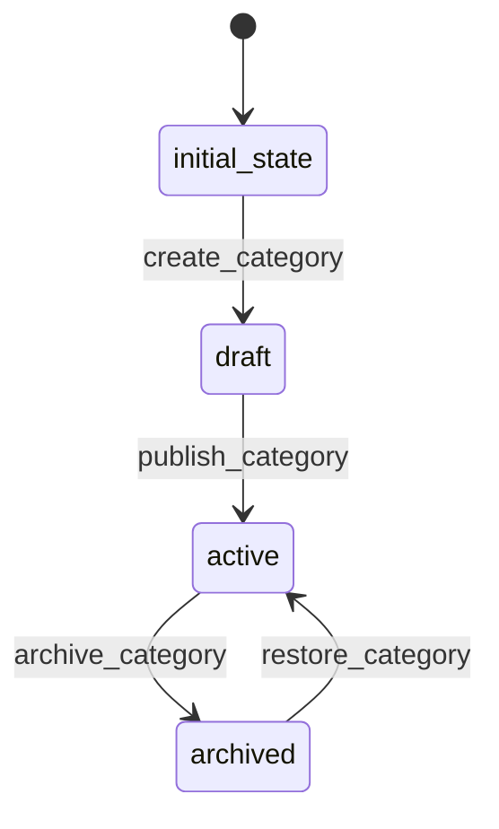

# Category Workflow

## Description
Manages the lifecycle of pet categories from creation to archival.

## States
- **initial_state**: Starting point
- **draft**: Category is being created/edited
- **active**: Category is active and visible
- **archived**: Category is archived and hidden

## Transitions

### initial_state → draft
- **Name**: create_category
- **Type**: Automatic
- **Processor**: CreateCategoryProcessor

### draft → active
- **Name**: publish_category
- **Type**: Manual
- **Processor**: PublishCategoryProcessor

### active → archived
- **Name**: archive_category
- **Type**: Manual
- **Processor**: ArchiveCategoryProcessor

### archived → active
- **Name**: restore_category
- **Type**: Manual
- **Processor**: RestoreCategoryProcessor

## Processors

### CreateCategoryProcessor
- **Entity**: Category
- **Input**: Category data
- **Purpose**: Initialize category creation
- **Output**: Category with draft status
- **Pseudocode**:
```
process(entity):
    entity.created_date = current_timestamp()
    entity.last_updated = current_timestamp()
    return entity
```

### PublishCategoryProcessor
- **Entity**: Category
- **Input**: Category entity
- **Purpose**: Publish category for use
- **Output**: Category with active status
- **Pseudocode**:
```
process(entity):
    entity.published_date = current_timestamp()
    entity.last_updated = current_timestamp()
    return entity
```

### ArchiveCategoryProcessor
- **Entity**: Category
- **Input**: Category entity
- **Purpose**: Archive category
- **Output**: Category with archived status
- **Pseudocode**:
```
process(entity):
    entity.archived_date = current_timestamp()
    entity.last_updated = current_timestamp()
    return entity
```

### RestoreCategoryProcessor
- **Entity**: Category
- **Input**: Category entity
- **Purpose**: Restore archived category
- **Output**: Category with active status
- **Pseudocode**:
```
process(entity):
    entity.restored_date = current_timestamp()
    entity.archived_date = null
    entity.last_updated = current_timestamp()
    return entity
```

## Mermaid State Diagram

```mermaid
stateDiagram-v2
    [*] --> initial_state
    initial_state --> draft : create_category
    draft --> active : publish_category
    active --> archived : archive_category
    archived --> active : restore_category
```
