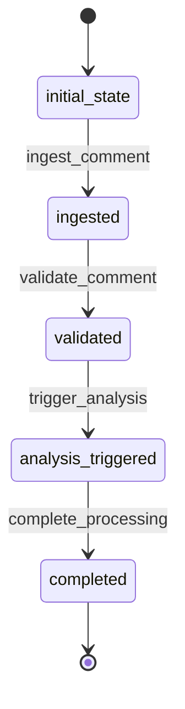

# Comment Workflow

## Description
Workflow for managing comment ingestion, validation, and triggering analysis.

## States
- **initial_state**: Starting point
- **ingested**: Comment data has been ingested from API
- **validated**: Comment data has been validated
- **analysis_triggered**: Analysis has been initiated
- **completed**: Comment processing is complete

## Transitions

### initial_state → ingested
- **Name**: ingest_comment
- **Type**: Automatic
- **Processor**: IngestCommentProcessor
- **Description**: Automatically ingest comment from external API

### ingested → validated  
- **Name**: validate_comment
- **Type**: Manual
- **Processor**: ValidateCommentProcessor
- **Description**: Validate comment data integrity and format

### validated → analysis_triggered
- **Name**: trigger_analysis
- **Type**: Manual
- **Processor**: TriggerAnalysisProcessor
- **Description**: Initiate analysis process for the comment

### analysis_triggered → completed
- **Name**: complete_processing
- **Type**: Manual
- **Description**: Mark comment processing as complete

## Mermaid State Diagram


## Processors

### IngestCommentProcessor
- **Entity**: Comment
- **Input**: External API data
- **Purpose**: Fetch and store comment data from external API
- **Output**: Comment entity with ingested data
- **Pseudocode**:
```
process(entity):
    api_data = fetch_from_external_api(entity.source_api, entity.external_id)
    entity.content = api_data.content
    entity.author = api_data.author
    entity.timestamp = api_data.timestamp
    entity.metadata = api_data.metadata
    entity.ingested_at = current_timestamp()
    return entity
```

### ValidateCommentProcessor
- **Entity**: Comment
- **Input**: Comment with ingested data
- **Purpose**: Validate comment data integrity and format
- **Output**: Validated comment entity
- **Pseudocode**:
```
process(entity):
    if not entity.content or len(entity.content.strip()) == 0:
        raise ValidationError("Comment content is empty")
    if not entity.author:
        raise ValidationError("Comment author is missing")
    entity.validation_status = "validated"
    return entity
```

### TriggerAnalysisProcessor
- **Entity**: Comment
- **Input**: Validated comment
- **Purpose**: Create analysis entity and trigger analysis workflow
- **Output**: Comment with analysis reference
- **Transition**: Creates new Analysis entity (null transition for Comment)
- **Pseudocode**:
```
process(entity):
    analysis_entity = create_analysis_entity(entity.id)
    trigger_analysis_workflow(analysis_entity.id)
    entity.analysis_triggered = true
    return entity
```
