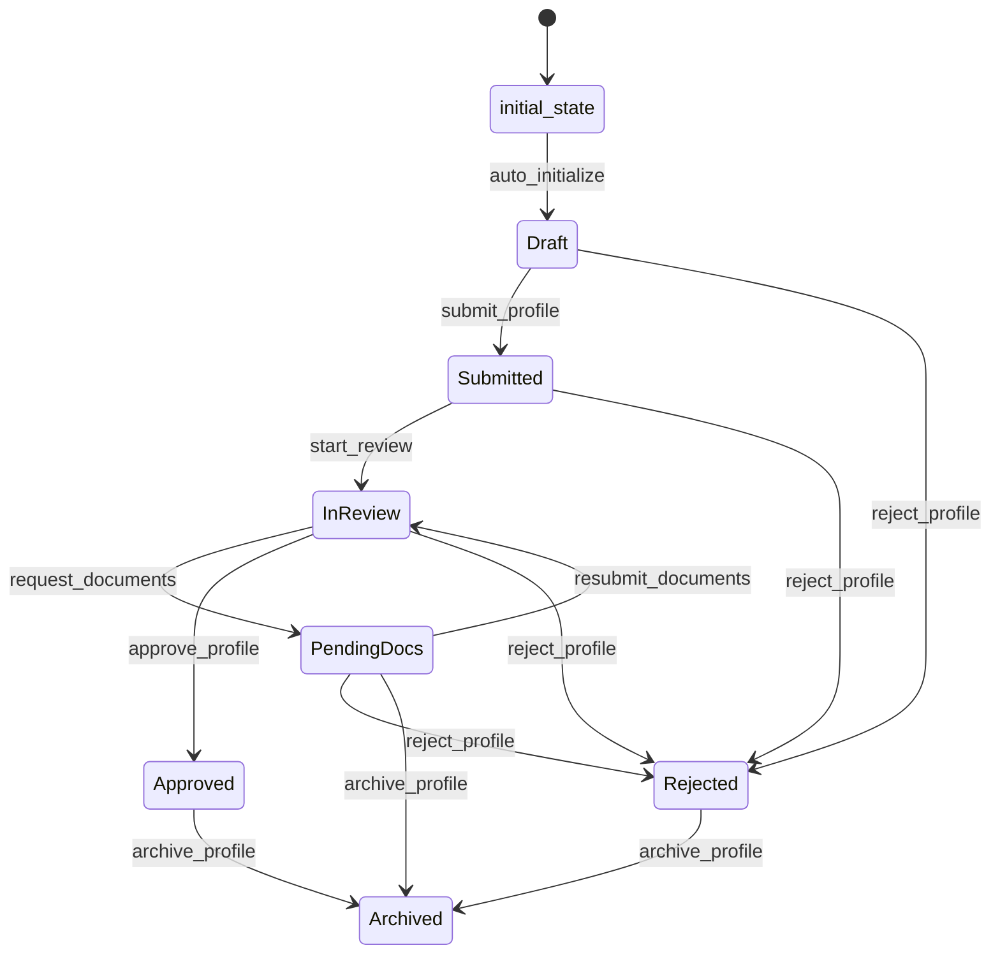

# CustomerProfile Workflow

## Overview
Stateful workflow managing customer onboarding from initial draft through final approval or rejection.

## Workflow States

### initial_state
Starting point for new CustomerProfile entities.

### Draft
Customer profile is being prepared with basic information.

### Submitted
Profile submitted for review with mandatory fields and minimum documents.

### InReview
Automated and manual checks are being performed.

### PendingDocs
Additional or updated documents are required.

### Approved
Profile has passed all checks and is approved for business.

### Rejected
Profile has been rejected with specific reason codes.

### Archived
Profile is archived (from any state for cleanup).

## State Transitions



## Transitions

### auto_initialize (initial_state → Draft)
- **Type**: Automatic
- **Processors**: InitializeProfile
- **Criteria**: None

### submit_profile (Draft → Submitted)
- **Type**: Manual
- **Processors**: ValidateSubmission
- **Criteria**: MandatoryFieldsComplete

### start_review (Submitted → InReview)
- **Type**: Automatic
- **Processors**: StartComplianceChecks
- **Criteria**: None

### request_documents (InReview → PendingDocs)
- **Type**: Manual
- **Processors**: None
- **Criteria**: DocumentsRequired

### approve_profile (InReview → Approved)
- **Type**: Manual
- **Processors**: FinalizeApproval
- **Criteria**: ApprovalRequirements

### reject_profile (Any → Rejected)
- **Type**: Manual
- **Processors**: ProcessRejection
- **Criteria**: None

### resubmit_documents (PendingDocs → InReview)
- **Type**: Manual
- **Processors**: ValidateDocuments
- **Criteria**: None

### archive_profile (Approved/Rejected/PendingDocs → Archived)
- **Type**: Manual
- **Processors**: ArchiveProfile
- **Criteria**: None

## SLA Timers
- InReview state: Escalate after 48 hours
- PendingDocs state: Escalate after 7 days

## Processors

### InitializeProfile
- **Entity**: CustomerProfile
- **Purpose**: Initialize new customer profile with default values
- **Input**: Empty or minimal entity data
- **Output**: Entity with initialized structure and Draft state
- **Pseudocode**:
```
process():
    entity.identity = {}
    entity.ownershipGraph = []
    entity.contacts = {emails: [], phones: []}
    entity.addresses = []
    entity.kycArtifacts = {documents: []}
    entity.risk = {riskScore: 0, riskFactors: [], pepFlags: [], sanctionsHits: []}
    entity.createdAt = current_timestamp()
    entity.updatedAt = current_timestamp()
```

### ValidateSubmission
- **Entity**: CustomerProfile
- **Purpose**: Validate mandatory fields and minimum document requirements
- **Input**: CustomerProfile entity
- **Output**: Validated entity with submission timestamp
- **Pseudocode**:
```
process():
    validate_identity_fields(entity.identity)
    validate_minimum_documents(entity.kycArtifacts)
    validate_contact_information(entity.contacts)
    entity.submittedAt = current_timestamp()
    entity.updatedAt = current_timestamp()
```

### StartComplianceChecks
- **Entity**: CustomerProfile
- **Purpose**: Initiate KYC, PEP/sanctions, and duplicate detection checks
- **Input**: Submitted CustomerProfile
- **Output**: Entity with compliance check results
- **Pseudocode**:
```
process():
    kyc_result = perform_kyc_verification(entity.identity, entity.kycArtifacts)
    pep_result = check_pep_sanctions(entity.identity, entity.ownershipGraph)
    duplicate_result = detect_duplicates(entity.identity)
    address_result = verify_addresses(entity.addresses)

    entity.risk.kycResult = kyc_result
    entity.risk.pepFlags = pep_result.pepFlags
    entity.risk.sanctionsHits = pep_result.sanctionsHits
    entity.complianceChecks = {
        kyc: kyc_result,
        pep: pep_result,
        duplicates: duplicate_result,
        addresses: address_result
    }
    entity.updatedAt = current_timestamp()
```

### FinalizeApproval
- **Entity**: CustomerProfile
- **Purpose**: Complete final approval process and set approval timestamp
- **Input**: CustomerProfile ready for approval
- **Output**: Approved entity with final risk assessment
- **Pseudocode**:
```
process():
    calculate_final_risk_score(entity)
    validate_ownership_coverage(entity.ownershipGraph)
    disposition_all_sanctions_hits(entity.risk.sanctionsHits)
    entity.approvedAt = current_timestamp()
    entity.approvedBy = current_user()
    entity.updatedAt = current_timestamp()
```

### ProcessRejection
- **Entity**: CustomerProfile
- **Purpose**: Process rejection with reason codes and notifications
- **Input**: CustomerProfile to be rejected
- **Output**: Rejected entity with reason codes
- **Pseudocode**:
```
process():
    entity.rejectedAt = current_timestamp()
    entity.rejectedBy = current_user()
    entity.rejectionReasons = get_rejection_reasons()
    send_rejection_notification(entity.contacts.emails)
    entity.updatedAt = current_timestamp()
```

### ValidateDocuments
- **Entity**: CustomerProfile
- **Purpose**: Validate newly submitted documents
- **Input**: CustomerProfile with updated documents
- **Output**: Entity with document validation results
- **Pseudocode**:
```
process():
    for document in entity.kycArtifacts.documents:
        if document.isNew:
            validate_document_integrity(document)
            verify_document_expiry(document)
            update_verification_result(document)
    entity.updatedAt = current_timestamp()
```

### ArchiveProfile
- **Entity**: CustomerProfile
- **Purpose**: Archive profile for long-term storage
- **Input**: CustomerProfile to be archived
- **Output**: Archived entity
- **Pseudocode**:
```
process():
    entity.archivedAt = current_timestamp()
    entity.archivedBy = current_user()
    create_audit_trail(entity)
    entity.updatedAt = current_timestamp()
```

## Criteria

### MandatoryFieldsComplete
- **Purpose**: Verify all mandatory fields are populated before submission
- **Pseudocode**:
```
check():
    if not entity.identity.legalName:
        return false
    if not entity.identity.registrationId:
        return false
    if not entity.identity.countryOfIncorporation:
        return false
    if not entity.contacts.emails or len(entity.contacts.emails) == 0:
        return false
    if not entity.kycArtifacts.documents or len(entity.kycArtifacts.documents) < 2:
        return false
    return true
```

### DocumentsRequired
- **Purpose**: Check if additional documents are needed
- **Pseudocode**:
```
check():
    required_docs = get_required_document_types(entity.identity.countryOfIncorporation)
    current_docs = [doc.type for doc in entity.kycArtifacts.documents]
    missing_docs = required_docs - current_docs
    expired_docs = [doc for doc in entity.kycArtifacts.documents if is_expired(doc)]

    return len(missing_docs) > 0 or len(expired_docs) > 0
```

### ApprovalRequirements
- **Purpose**: Verify all approval conditions are met
- **Pseudocode**:
```
check():
    # Verified identity
    if not entity.complianceChecks.kyc.verified:
        return false

    # Ownership coverage >= 75%
    ownership_coverage = calculate_ownership_coverage(entity.ownershipGraph)
    if ownership_coverage < 75:
        return false

    # Risk score within threshold
    if entity.risk.riskScore > get_risk_threshold():
        return false

    # All sanctions hits dispositioned
    undispositioned_hits = [hit for hit in entity.risk.sanctionsHits if not hit.disposition]
    if len(undispositioned_hits) > 0:
        return false

    return true
```
