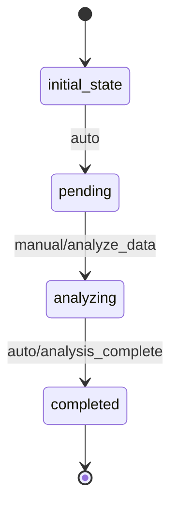

# DataAnalysis Workflow

## States and Transitions

### States:
- **initial_state**: Starting point
- **pending**: Ready for analysis
- **analyzing**: Analysis in progress
- **completed**: Analysis finished

### Transitions:

1. **initial_state → pending**: Automatic transition to start workflow
2. **pending → analyzing**: Manual transition to start analysis
   - **Processor**: `analyze_data` - Performs pandas analysis on data
3. **analyzing → completed**: Automatic transition when analysis finishes
   - **Criteria**: `analysis_complete` - Checks if analysis is finished

## Processors

### analyze_data
- **Entity**: DataAnalysis
- **Input**: Data source reference, analysis type
- **Purpose**: Analyze data using pandas and generate insights
- **Output**: Analysis results, metrics, insights

**Pseudocode:**
```
process():
    data = load_data_from_source(entity.data_source_id)
    df = pandas.read_csv(data)
    
    # Perform analysis based on type
    if entity.analysis_type == "summary":
        results = {
            "total_records": len(df),
            "columns": list(df.columns),
            "summary_stats": df.describe().to_dict()
        }
    elif entity.analysis_type == "statistical":
        results = {
            "correlations": df.corr().to_dict(),
            "price_stats": df['Price (£)'].describe().to_dict(),
            "neighborhood_counts": df['Neighborhood'].value_counts().to_dict()
        }
    
    entity.results = results
    entity.metrics = calculate_metrics(df)
    entity.created_at = current_timestamp()
```

## Criteria

### analysis_complete
**Pseudocode:**
```
check():
    return entity.results is not None and entity.metrics is not None
```

## Workflow Diagram


