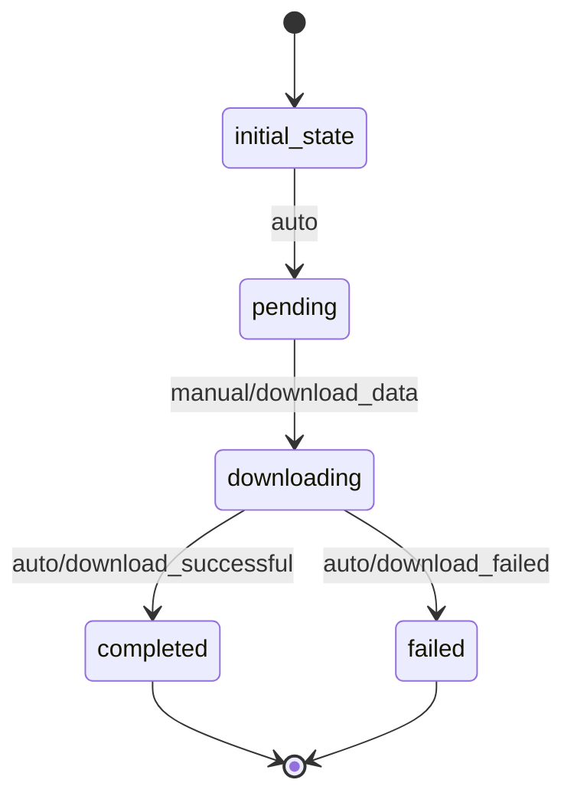

# DataSource Workflow

## States and Transitions

### States:
- **initial_state**: Starting point
- **pending**: Ready to download
- **downloading**: Download in progress
- **completed**: Download successful
- **failed**: Download failed

### Transitions:

1. **initial_state → pending**: Automatic transition to start workflow
2. **pending → downloading**: Manual transition to start download
   - **Processor**: `download_data` - Downloads data from URL
3. **downloading → completed**: Automatic transition when download succeeds
   - **Criteria**: `download_successful` - Checks if download completed successfully
4. **downloading → failed**: Automatic transition when download fails
   - **Criteria**: `download_failed` - Checks if download failed

## Processors

### download_data
- **Entity**: DataSource
- **Input**: URL, data format
- **Purpose**: Download data from the specified URL
- **Output**: Downloaded file data, file size, status update

**Pseudocode:**
```
process():
    try:
        response = http_get(entity.url)
        if response.status_code == 200:
            entity.file_size = len(response.content)
            entity.last_downloaded = current_timestamp()
            entity.status = "completed"
            save_file(response.content)
        else:
            entity.status = "failed"
    except Exception:
        entity.status = "failed"
```

## Criteria

### download_successful
**Pseudocode:**
```
check():
    return entity.status == "completed"
```

### download_failed
**Pseudocode:**
```
check():
    return entity.status == "failed"
```

## Workflow Diagram


