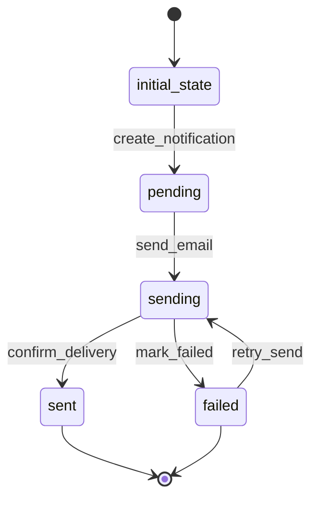

# EmailNotification Workflow

## States
- **initial_state**: Starting point
- **pending**: Email notification created and queued
- **sending**: Email being sent
- **sent**: Email successfully delivered
- **failed**: Email delivery failed permanently

## Transitions

### initial_state → pending
- **Name**: create_notification
- **Type**: Automatic
- **Processor**: CreateNotificationProcessor
- **Description**: Creates email notification from weather data

### pending → sending
- **Name**: send_email
- **Type**: Manual
- **Processor**: SendEmailProcessor
- **Criteria**: ValidRecipientCriteria
- **Description**: Sends email notification to user

### sending → sent
- **Name**: confirm_delivery
- **Type**: Manual
- **Processor**: ConfirmDeliveryProcessor
- **Description**: Confirms successful email delivery

### sending → failed
- **Name**: mark_failed
- **Type**: Manual
- **Processor**: MarkFailedProcessor
- **Criteria**: MaxRetriesCriteria
- **Description**: Marks email as permanently failed

### failed → sending
- **Name**: retry_send
- **Type**: Manual
- **Processor**: RetrySendProcessor
- **Description**: Retries sending failed email

## Mermaid State Diagram


## Processors

### CreateNotificationProcessor
- **Entity**: EmailNotification
- **Input**: User and WeatherData entities
- **Purpose**: Create email notification with weather content
- **Output**: EmailNotification entity with pending state
- **Pseudocode**:
```
process(entity):
    weather_data = get_weather_data(entity.weather_data_id)
    user = get_user(entity.user_id)
    entity.recipient_email = user.email
    entity.subject = format_subject(weather_data.location, weather_data.forecast_date)
    entity.content = format_weather_email(weather_data)
    entity.delivery_status = "pending"
    entity.meta.state = "pending"
    return entity
```

### SendEmailProcessor
- **Entity**: EmailNotification
- **Input**: EmailNotification entity
- **Purpose**: Send email notification to recipient
- **Output**: EmailNotification entity with sending state
- **Pseudocode**:
```
process(entity):
    entity.delivery_status = "sending"
    entity.meta.state = "sending"
    send_email_via_smtp(entity.recipient_email, entity.subject, entity.content)
    entity.retry_count += 1
    return entity
```

### ConfirmDeliveryProcessor
- **Entity**: EmailNotification
- **Input**: EmailNotification entity
- **Purpose**: Confirm successful email delivery
- **Output**: EmailNotification entity with sent state
- **Pseudocode**:
```
process(entity):
    entity.delivery_status = "sent"
    entity.sent_timestamp = current_timestamp()
    entity.meta.state = "sent"
    return entity
```

### MarkFailedProcessor
- **Entity**: EmailNotification
- **Input**: EmailNotification entity
- **Purpose**: Mark email as permanently failed
- **Output**: EmailNotification entity with failed state
- **Pseudocode**:
```
process(entity):
    entity.delivery_status = "failed"
    entity.meta.state = "failed"
    log_email_failure(entity)
    return entity
```

### RetrySendProcessor
- **Entity**: EmailNotification
- **Input**: EmailNotification entity
- **Purpose**: Retry sending failed email
- **Output**: EmailNotification entity with sending state
- **Pseudocode**:
```
process(entity):
    if entity.retry_count < 3:
        entity.delivery_status = "sending"
        entity.meta.state = "sending"
        send_email_via_smtp(entity.recipient_email, entity.subject, entity.content)
        entity.retry_count += 1
    return entity
```

## Criteria

### ValidRecipientCriteria
- **Purpose**: Validate recipient email and user status
- **Pseudocode**:
```
check(entity):
    user = get_user(entity.user_id)
    if not user.active:
        return false
    if not is_valid_email(entity.recipient_email):
        return false
    return true
```

### MaxRetriesCriteria
- **Purpose**: Check if maximum retry attempts reached
- **Pseudocode**:
```
check(entity):
    return entity.retry_count >= 3
```
