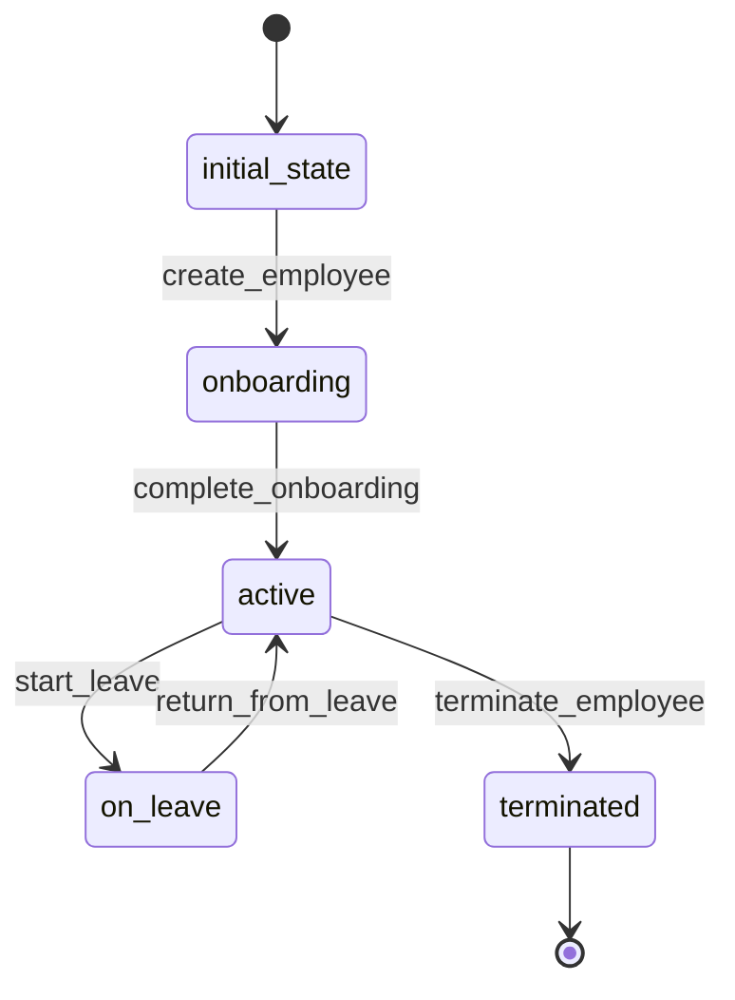

# Employee Workflow

## States
- **initial_state**: Starting point
- **onboarding**: Employee record created, pending setup
- **active**: Employee is active and working
- **on_leave**: Employee is temporarily on leave
- **terminated**: Employee is no longer with company

## Transitions

### initial_state → onboarding
- **Name**: create_employee
- **Type**: Automatic
- **Processor**: CreateEmployeeProcessor
- **Description**: Creates employee record

### onboarding → active
- **Name**: complete_onboarding
- **Type**: Manual
- **Processor**: CompleteOnboardingProcessor
- **Criteria**: ValidateEmployeeSetup
- **Description**: Completes employee onboarding

### active → on_leave
- **Name**: start_leave
- **Type**: Manual
- **Processor**: StartLeaveProcessor
- **Description**: Puts employee on leave

### on_leave → active
- **Name**: return_from_leave
- **Type**: Manual
- **Processor**: ReturnFromLeaveProcessor
- **Description**: Returns employee from leave

### active → terminated
- **Name**: terminate_employee
- **Type**: Manual
- **Processor**: TerminateEmployeeProcessor
- **Description**: Terminates employee

## Processors

### CreateEmployeeProcessor
- **Purpose**: Initialize employee record
- **Input**: Employee entity data
- **Output**: Employee in onboarding state
- **Pseudocode**:
```
process(entity):
    entity.is_active = false
    entity.created_at = current_timestamp()
    validate_position_exists(entity.position_id)
    generate_employee_id(entity)
```

### CompleteOnboardingProcessor
- **Purpose**: Activate employee after onboarding
- **Input**: Employee entity
- **Output**: Active employee
- **Pseudocode**:
```
process(entity):
    entity.is_active = true
    entity.onboarding_completed_at = current_timestamp()
    if entity.user_id:
        activate_user_account(entity.user_id)
```

### TerminateEmployeeProcessor
- **Purpose**: Terminate employee and cleanup
- **Input**: Employee entity
- **Output**: Terminated employee
- **Pseudocode**:
```
process(entity):
    entity.is_active = false
    entity.terminated_at = current_timestamp()
    if entity.user_id:
        deactivate_user_account(entity.user_id)
```

## Criteria

### ValidateEmployeeSetup
- **Purpose**: Ensure employee has required setup
- **Pseudocode**:
```
check(entity):
    return entity.position_id is not None and entity.hire_date is not None
```

## Mermaid State Diagram

