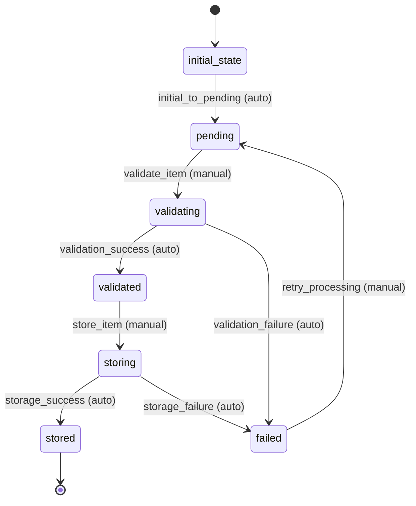

# HN Item Workflow

## Overview
The HN Item workflow manages the lifecycle of individual Hacker News items from creation through validation, storage, and potential updates. It handles items from multiple sources: Firebase API pulls, manual posts, and bulk uploads.

## Workflow States

### 1. initial_state
- **Description**: Starting state for all new HN items
- **Entry Condition**: Item is created
- **Exit Condition**: Automatic transition to pending state

### 2. pending
- **Description**: Item is pending validation and processing
- **Entry Condition**: Item has been created and basic data is available
- **Exit Condition**: Item passes validation or fails validation

### 3. validating
- **Description**: Item is undergoing validation checks
- **Entry Condition**: Item has passed initial checks and is ready for detailed validation
- **Exit Condition**: Validation completes successfully or fails

### 4. validated
- **Description**: Item has passed all validation checks
- **Entry Condition**: All validation criteria are met
- **Exit Condition**: Item is ready for storage

### 5. storing
- **Description**: Item is being stored in the database
- **Entry Condition**: Item is validated and ready for persistence
- **Exit Condition**: Storage operation completes

### 6. stored
- **Description**: Item has been successfully stored and is available
- **Entry Condition**: Storage operation completed successfully
- **Exit Condition**: Item may be updated or archived

### 7. failed
- **Description**: Item processing has failed
- **Entry Condition**: Validation or storage failed
- **Exit Condition**: Manual intervention or retry

## Workflow Transitions

### 1. initial_to_pending
- **From**: initial_state
- **To**: pending
- **Type**: Automatic
- **Trigger**: Item creation
- **Processors**: None
- **Criteria**: None

### 2. validate_item
- **From**: pending
- **To**: validating
- **Type**: Manual
- **Trigger**: Validation request
- **Processors**: validate_hn_item_processor
- **Criteria**: None

### 3. validation_success
- **From**: validating
- **To**: validated
- **Type**: Automatic
- **Trigger**: Validation completion
- **Processors**: None
- **Criteria**: validation_success_criterion

### 4. validation_failure
- **From**: validating
- **To**: failed
- **Type**: Automatic
- **Trigger**: Validation failure
- **Processors**: handle_validation_failure_processor
- **Criteria**: validation_failure_criterion

### 5. store_item
- **From**: validated
- **To**: storing
- **Type**: Manual
- **Trigger**: Storage request
- **Processors**: store_hn_item_processor
- **Criteria**: None

### 6. storage_success
- **From**: storing
- **To**: stored
- **Type**: Automatic
- **Trigger**: Storage completion
- **Processors**: finalize_storage_processor
- **Criteria**: storage_success_criterion

### 7. storage_failure
- **From**: storing
- **To**: failed
- **Type**: Automatic
- **Trigger**: Storage failure
- **Processors**: handle_storage_failure_processor
- **Criteria**: storage_failure_criterion

### 8. retry_processing
- **From**: failed
- **To**: pending
- **Type**: Manual
- **Trigger**: Retry request
- **Processors**: reset_item_processor
- **Criteria**: retry_allowed_criterion

## Workflow Diagram



## Processors

### 1. validate_hn_item_processor
- **Entity**: HnItem
- **Purpose**: Validate HN item data against Firebase HN API schema and business rules
- **Input**: HN item entity with raw data
- **Output**: Validated entity with validation results
- **Pseudocode**:
```
process(entity):
    validation_errors = []
    
    // Validate required fields
    if not entity.id:
        validation_errors.append("ID is required")
    if not entity.type or entity.type not in ["job", "story", "comment", "poll", "pollopt"]:
        validation_errors.append("Invalid or missing type")
    
    // Validate type-specific rules
    if entity.type == "comment" and not entity.parent:
        validation_errors.append("Comments must have a parent")
    if entity.type == "pollopt" and not entity.poll:
        validation_errors.append("Poll options must reference a poll")
    
    // Validate relationships
    if entity.parent and not item_exists(entity.parent):
        validation_errors.append("Parent item does not exist")
    if entity.kids:
        for kid_id in entity.kids:
            if not item_exists(kid_id):
                validation_errors.append(f"Child item {kid_id} does not exist")
    
    // Store validation results
    entity.validation_errors = validation_errors
    entity.validation_status = "passed" if not validation_errors else "failed"
    entity.validated_at = current_timestamp()
    
    return entity
```

### 2. handle_validation_failure_processor
- **Entity**: HnItem
- **Purpose**: Handle validation failures and prepare for retry or manual intervention
- **Input**: Entity with validation errors
- **Output**: Entity with failure handling information
- **Pseudocode**:
```
process(entity):
    entity.failure_reason = "validation_failed"
    entity.failure_details = entity.validation_errors
    entity.failed_at = current_timestamp()
    entity.retry_count = entity.retry_count + 1 if entity.retry_count else 1
    
    // Log validation failure
    log_error(f"HN Item {entity.id} validation failed", entity.validation_errors)
    
    return entity
```

### 3. store_hn_item_processor
- **Entity**: HnItem
- **Purpose**: Store validated HN item in the database
- **Input**: Validated HN item entity
- **Output**: Entity with storage information
- **Pseudocode**:
```
process(entity):
    try:
        // Check for duplicates
        if item_exists_in_db(entity.id):
            entity.storage_action = "updated"
            update_existing_item(entity)
        else:
            entity.storage_action = "created"
            create_new_item(entity)
        
        entity.stored_at = current_timestamp()
        entity.storage_status = "success"
        
        // Update relationships
        update_parent_child_relationships(entity)
        update_collection_references(entity)
        
    except Exception as e:
        entity.storage_status = "failed"
        entity.storage_error = str(e)
        
    return entity
```

### 4. finalize_storage_processor
- **Entity**: HnItem
- **Purpose**: Finalize storage and perform post-storage operations
- **Input**: Successfully stored entity
- **Output**: Finalized entity
- **Pseudocode**:
```
process(entity):
    // Update search index
    update_search_index(entity)
    
    // Update statistics
    update_item_statistics(entity.type)
    
    // Trigger notifications if needed
    if entity.source == "firebase_api":
        notify_new_item_from_api(entity)
    
    entity.processing_completed_at = current_timestamp()
    entity.status = "active"
    
    return entity
```

### 5. handle_storage_failure_processor
- **Entity**: HnItem
- **Purpose**: Handle storage failures and prepare for retry
- **Input**: Entity with storage failure
- **Output**: Entity with failure handling
- **Pseudocode**:
```
process(entity):
    entity.failure_reason = "storage_failed"
    entity.failure_details = entity.storage_error
    entity.failed_at = current_timestamp()
    entity.retry_count = entity.retry_count + 1 if entity.retry_count else 1
    
    // Log storage failure
    log_error(f"HN Item {entity.id} storage failed", entity.storage_error)
    
    return entity
```

### 6. reset_item_processor
- **Entity**: HnItem
- **Purpose**: Reset item for retry processing
- **Input**: Failed entity
- **Output**: Reset entity ready for retry
- **Pseudocode**:
```
process(entity):
    // Clear previous failure information
    entity.validation_errors = []
    entity.storage_error = None
    entity.failure_reason = None
    entity.failure_details = None
    
    // Reset status
    entity.validation_status = None
    entity.storage_status = None
    
    // Update retry information
    entity.retry_attempted_at = current_timestamp()
    
    return entity
```

## Criteria

### 1. validation_success_criterion
- **Purpose**: Check if validation was successful
- **Pseudocode**:
```
check(entity):
    return entity.validation_status == "passed" and not entity.validation_errors
```

### 2. validation_failure_criterion
- **Purpose**: Check if validation failed
- **Pseudocode**:
```
check(entity):
    return entity.validation_status == "failed" or entity.validation_errors
```

### 3. storage_success_criterion
- **Purpose**: Check if storage was successful
- **Pseudocode**:
```
check(entity):
    return entity.storage_status == "success" and entity.stored_at
```

### 4. storage_failure_criterion
- **Purpose**: Check if storage failed
- **Pseudocode**:
```
check(entity):
    return entity.storage_status == "failed" or entity.storage_error
```

### 5. retry_allowed_criterion
- **Purpose**: Check if retry is allowed for failed item
- **Pseudocode**:
```
check(entity):
    max_retries = 3
    return entity.retry_count < max_retries and entity.failure_reason in ["validation_failed", "storage_failed"]
```
