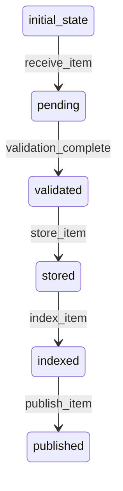

# HNItem Workflow

## States
- **initial_state**: Starting state
- **pending**: Item received, awaiting validation
- **validated**: Item structure validated
- **stored**: Item successfully stored
- **indexed**: Item indexed for search
- **published**: Item available for queries

## Transitions

### initial_state → pending
- **Name**: receive_item
- **Type**: Automatic
- **Processor**: validate_item_structure
- **Purpose**: Validate Firebase HN API format

### pending → validated  
- **Name**: validation_complete
- **Type**: Manual
- **Processor**: enrich_item_data
- **Purpose**: Enrich with metadata and relationships

### validated → stored
- **Name**: store_item
- **Type**: Manual
- **Processor**: persist_item
- **Purpose**: Save to database

### stored → indexed
- **Name**: index_item
- **Type**: Automatic
- **Processor**: create_search_index
- **Purpose**: Index for search functionality

### indexed → published
- **Name**: publish_item
- **Type**: Automatic
- **Purpose**: Make available for queries

## Processors

### validate_item_structure
- **Entity**: HNItem
- **Input**: Raw HN item data
- **Purpose**: Validate Firebase API format
- **Output**: Validated item with validation status
- **Pseudocode**:
```
process(entity):
    required_fields = ["id", "type"]
    if not all(field in entity for field in required_fields):
        entity.validation_error = "Missing required fields"
        return
    
    if entity.type not in ["job", "story", "comment", "poll", "pollopt"]:
        entity.validation_error = "Invalid type"
        return
        
    entity.validation_status = "valid"
```

### enrich_item_data
- **Entity**: HNItem
- **Input**: Validated item
- **Purpose**: Add metadata and resolve relationships
- **Output**: Enriched item
- **Pseudocode**:
```
process(entity):
    entity.processed_time = current_timestamp()
    entity.search_text = combine_title_and_text(entity)
    if entity.parent:
        entity.parent_chain = build_parent_chain(entity.parent)
```

### persist_item
- **Entity**: HNItem
- **Input**: Enriched item
- **Purpose**: Save to database
- **Output**: Stored item with ID
- **Pseudocode**:
```
process(entity):
    entity.stored_at = current_timestamp()
    entity.storage_status = "persisted"
```

### create_search_index
- **Entity**: HNItem
- **Input**: Stored item
- **Purpose**: Create search index entries
- **Output**: Indexed item
- **Pseudocode**:
```
process(entity):
    create_text_index(entity.search_text)
    create_hierarchy_index(entity.parent_chain)
    entity.indexed_at = current_timestamp()
```

## Workflow Diagram


```mermaid
stateDiagram-v2
    initial_state --> pending: receive_item
    pending --> validated: validation_complete
    validated --> stored: store_item
    stored --> indexed: index_item
    indexed --> published: publish_item
```
