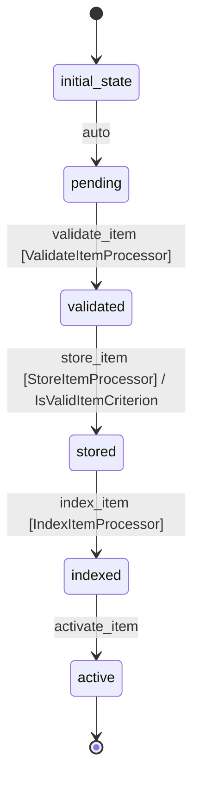

# HNItem Workflow Requirements

## Workflow States

1. **initial_state** - Starting point for all HN items
2. **pending** - Item received but not yet processed
3. **validated** - Item structure and content validated
4. **stored** - Item successfully stored in system
5. **indexed** - Item indexed for search functionality
6. **active** - Item is live and searchable

## State Transitions

### Automatic Transitions
- **initial_state → pending**: Automatic transition when item is created

### Manual Transitions  
- **pending → validated**: Validate item structure and content
- **validated → stored**: Store item in database
- **stored → indexed**: Index item for search
- **indexed → active**: Activate item for public access

## Processors

### 1. ValidateItemProcessor
- **Entity**: HNItem
- **Purpose**: Validate HN item structure and required fields
- **Input**: Raw HN item data
- **Output**: Validated item with validation status
- **Pseudocode**:
```
process(entity):
    if entity.id is null or not integer:
        entity.validation_error = "Invalid ID"
        return
    if entity.type not in ["story", "comment", "job", "poll", "pollopt"]:
        entity.validation_error = "Invalid type"
        return
    entity.validation_status = "valid"
```

### 2. StoreItemProcessor  
- **Entity**: HNItem
- **Purpose**: Store validated item in database
- **Input**: Validated HN item
- **Output**: Item with storage confirmation
- **Pseudocode**:
```
process(entity):
    save_to_database(entity)
    entity.storage_status = "stored"
    entity.stored_timestamp = current_time()
```

### 3. IndexItemProcessor
- **Entity**: HNItem  
- **Purpose**: Index item for search functionality
- **Input**: Stored HN item
- **Output**: Item with search index status
- **Pseudocode**:
```
process(entity):
    create_search_index(entity)
    if entity.parent:
        update_parent_hierarchy_index(entity.parent)
    entity.index_status = "indexed"
```

## Criteria

### 1. IsValidItemCriterion
- **Purpose**: Check if item passed validation
- **Pseudocode**:
```
check(entity) -> bool:
    return entity.validation_status == "valid"
```

## Workflow Diagram


```mermaid
stateDiagram-v2
    [*] --> initial_state
    initial_state --> pending : auto
    pending --> validated : validate_item [ValidateItemProcessor]
    validated --> stored : store_item [StoreItemProcessor] / IsValidItemCriterion
    stored --> indexed : index_item [IndexItemProcessor]  
    indexed --> active : activate_item
    active --> [*]
```

## Business Rules
- Items must pass validation before storage
- Failed validation items remain in pending state
- Search indexing includes parent hierarchy updates
- Only active items are publicly searchable
