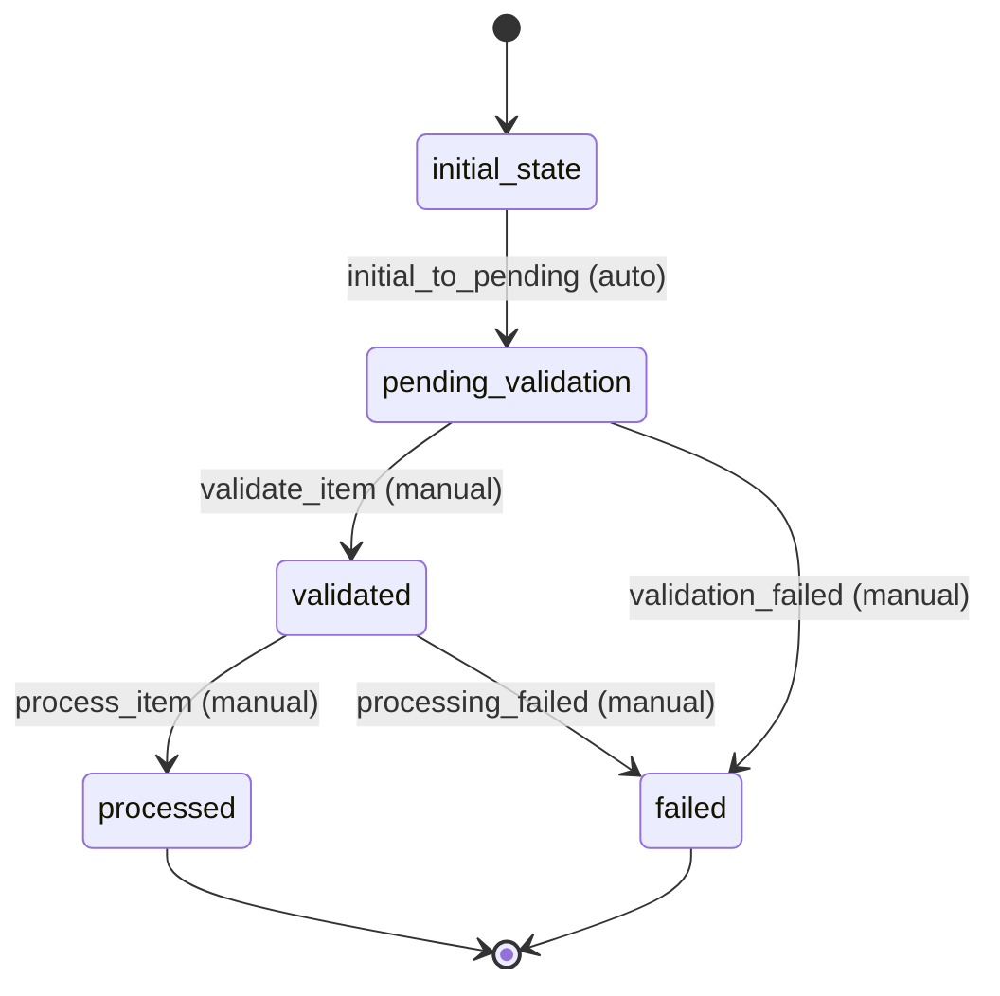

# HN Item Workflow Requirements

## Workflow Name
HnItem

## Description
Manages the lifecycle of Hacker News items from creation through processing and storage.

## States

### 1. initial_state
- **Description**: Starting state for all new HN items
- **Entry**: Automatic when item is created

### 2. pending_validation
- **Description**: Item is awaiting validation of required fields and format
- **Entry**: Automatic transition from initial_state

### 3. validated
- **Description**: Item has passed validation and is ready for processing
- **Entry**: After successful validation

### 4. processed
- **Description**: Item has been processed and stored successfully
- **Entry**: After successful processing

### 5. failed
- **Description**: Item processing failed due to validation or processing errors
- **Entry**: When validation or processing fails

## Transitions

### 1. initial_to_pending (initial_state → pending_validation)
- **Type**: Automatic
- **Manual**: false
- **Processors**: None
- **Criteria**: None

### 2. validate_item (pending_validation → validated)
- **Type**: Manual
- **Manual**: true
- **Processors**: [ValidateHnItemProcessor]
- **Criteria**: None

### 3. validation_failed (pending_validation → failed)
- **Type**: Manual
- **Manual**: true
- **Processors**: None
- **Criteria**: [ValidationFailedCriterion]

### 4. process_item (validated → processed)
- **Type**: Manual
- **Manual**: true
- **Processors**: [ProcessHnItemProcessor]
- **Criteria**: None

### 5. processing_failed (validated → failed)
- **Type**: Manual
- **Manual**: true
- **Processors**: None
- **Criteria**: [ProcessingFailedCriterion]

## Processors

### 1. ValidateHnItemProcessor
- **Entity**: HnItem
- **Purpose**: Validates HN item data format and required fields
- **Expected Input**: HnItem entity with raw data
- **Expected Output**: HnItem entity with validation status
- **Transition**: validate_item

**Pseudocode for process() method:**
```
function process(entity):
    validation_errors = []
    
    // Validate required fields
    if not entity.id:
        validation_errors.append("ID is required")
    if not entity.type or entity.type not in ["job", "story", "comment", "poll", "pollopt"]:
        validation_errors.append("Valid type is required")
    
    // Validate type-specific requirements
    if entity.type == "comment" and not entity.parent:
        validation_errors.append("Comments must have a parent")
    if entity.type == "pollopt" and not entity.poll:
        validation_errors.append("Poll options must reference a poll")
    
    // Set validation results
    entity.validation_errors = validation_errors
    entity.is_valid = len(validation_errors) == 0
    
    return entity
```

### 2. ProcessHnItemProcessor
- **Entity**: HnItem
- **Purpose**: Processes and enriches HN item data for storage
- **Expected Input**: Validated HnItem entity
- **Expected Output**: Processed HnItem entity ready for storage
- **Transition**: process_item

**Pseudocode for process() method:**
```
function process(entity):
    // Enrich item data
    entity.processed_at = current_timestamp()
    
    // Calculate derived fields
    if entity.kids:
        entity.direct_children_count = len(entity.kids)
    
    // Set processing status
    entity.processing_status = "completed"
    entity.processed = true
    
    return entity
```

## Criteria

### 1. ValidationFailedCriterion
- **Purpose**: Checks if validation has failed

**Pseudocode for check() method:**
```
function check(entity):
    return entity.is_valid == false
```

### 2. ProcessingFailedCriterion
- **Purpose**: Checks if processing has failed

**Pseudocode for check() method:**
```
function check(entity):
    return entity.processing_status == "failed"
```

## Workflow State Diagram


```mermaid
stateDiagram-v2
    [*] --> initial_state
    initial_state --> pending_validation : initial_to_pending (auto)
    pending_validation --> validated : validate_item (manual)
    pending_validation --> failed : validation_failed (manual)
    validated --> processed : process_item (manual)
    validated --> failed : processing_failed (manual)
    processed --> [*]
    failed --> [*]
```
