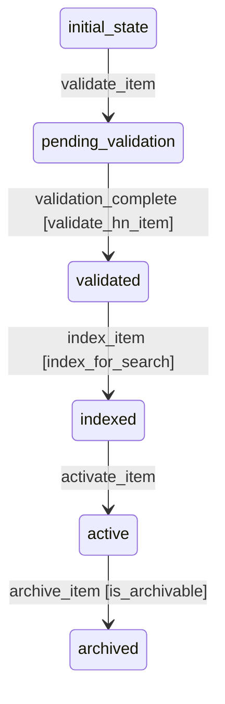

# HNItem Workflow Requirements

## Workflow States
1. **initial_state**: Starting point for new items
2. **pending_validation**: Item awaits validation
3. **validated**: Item passed validation checks
4. **indexed**: Item indexed for search
5. **active**: Item is live and searchable
6. **archived**: Item moved to archive

## Transitions
- **validate_item**: initial_state → pending_validation (automatic)
- **validation_complete**: pending_validation → validated (manual, with processor)
- **index_item**: validated → indexed (manual, with processor)
- **activate_item**: indexed → active (automatic)
- **archive_item**: active → archived (manual, with criteria)

## Processors
1. **validate_hn_item**: Validates HN item structure and required fields
2. **index_for_search**: Indexes item content for search functionality

## Criteria
1. **is_archivable**: Checks if item can be archived based on age or status

## Workflow Diagram

```mermaid
stateDiagram-v2
    initial_state --> pending_validation : validate_item
    pending_validation --> validated : validation_complete [validate_hn_item]
    validated --> indexed : index_item [index_for_search]
    indexed --> active : activate_item
    active --> archived : archive_item [is_archivable]
```

## Processor Details

### validate_hn_item
- **Purpose**: Validate HN item structure and data integrity
- **Input**: HN item entity
- **Process**: Check required fields, validate data types, ensure HN API compliance
- **Output**: Validated entity with validation status

### index_for_search
- **Purpose**: Index item for search functionality
- **Input**: Validated HN item
- **Process**: Extract searchable content, create search indices, update search database
- **Output**: Entity with search indexing status

## Criteria Details

### is_archivable
- **Purpose**: Determine if item should be archived
- **Check**: Item age > 30 days OR item marked as deleted/dead
- **Returns**: Boolean indicating archival eligibility
