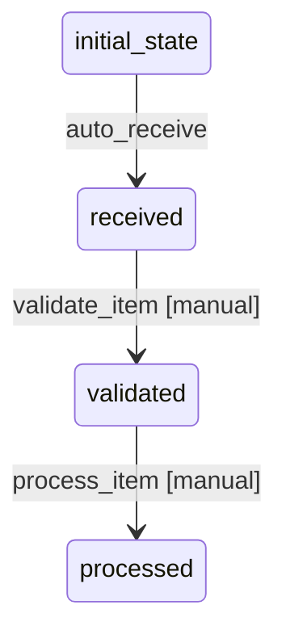

# HN Item Workflow

## Overview
Manages the lifecycle of Hacker News items from creation through processing and storage.

## Workflow States

### 1. initial_state
- Starting point for all new HN items
- Automatic transition to `received`

### 2. received
- Item data has been received (via API, POST, or bulk upload)
- Manual transition to `validated` with validation processor

### 3. validated
- Item data has passed validation checks
- Manual transition to `processed` with processing processor

### 4. processed
- Item has been processed and stored
- Terminal state

## State Transitions


```mermaid
stateDiagram-v2
    initial_state --> received: auto_receive
    received --> validated: validate_item [manual]
    validated --> processed: process_item [manual]
```

## Processors

### 1. validate_item_processor
- **Entity**: HnItem
- **Input**: Raw HN item data
- **Purpose**: Validates item structure, required fields, and data types
- **Output**: Validated item with validation status
- **Pseudocode**:
```
process(entity):
    if entity.id is null or not integer:
        throw ValidationError("Invalid ID")
    if entity.type not in ["story", "comment", "job", "poll", "pollopt"]:
        throw ValidationError("Invalid type")
    if entity.type == "story" and entity.title is null:
        throw ValidationError("Story requires title")
    entity.validation_status = "valid"
    return entity
```

### 2. process_item_processor
- **Entity**: HnItem
- **Input**: Validated HN item
- **Purpose**: Processes item for storage, handles parent-child relationships
- **Output**: Processed item ready for queries
- **Pseudocode**:
```
process(entity):
    entity.processed_time = current_timestamp()
    if entity.parent:
        update_parent_children_count(entity.parent)
    if entity.kids:
        entity.children_count = len(entity.kids)
    entity.processing_status = "complete"
    return entity
```

## Criteria
None required - all transitions are manual with processors handling validation and business logic.
