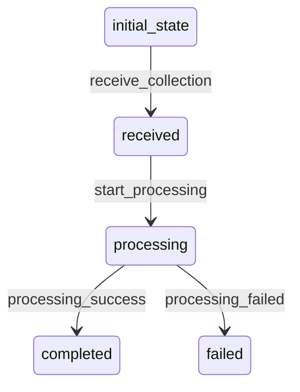

# HNItemCollection Workflow

## States
- **initial_state**: Starting state
- **received**: Collection received
- **processing**: Items being processed
- **completed**: All items processed successfully
- **failed**: Processing failed with errors

## Transitions

### initial_state → received
- **Name**: receive_collection
- **Type**: Automatic
- **Processor**: validate_collection
- **Purpose**: Validate collection format and structure

### received → processing
- **Name**: start_processing
- **Type**: Manual
- **Processor**: process_items_batch
- **Purpose**: Begin batch processing of items

### processing → completed
- **Name**: processing_success
- **Type**: Automatic
- **Criterion**: all_items_processed_successfully
- **Purpose**: Mark collection as successfully completed

### processing → failed
- **Name**: processing_failed
- **Type**: Automatic
- **Criterion**: processing_has_critical_errors
- **Purpose**: Mark collection as failed

## Processors

### validate_collection
- **Entity**: HNItemCollection
- **Input**: Raw collection data
- **Purpose**: Validate collection structure and extract items
- **Output**: Validated collection with item count
- **Pseudocode**:
```
process(entity):
    if entity.collection_type == "array":
        entity.total_items = len(entity.items)
    elif entity.collection_type == "file_upload":
        entity.items = parse_json_file(entity.source)
        entity.total_items = len(entity.items)
    elif entity.collection_type == "firebase_pull":
        entity.items = fetch_from_firebase_api()
        entity.total_items = len(entity.items)
    
    entity.processed_items = 0
    entity.failed_items = 0
```

### process_items_batch
- **Entity**: HNItemCollection
- **Input**: Validated collection
- **Purpose**: Process each item in the collection
- **Output**: Collection with processing results
- **Pseudocode**:
```
process(entity):
    for item in entity.items:
        try:
            hnitem_id = create_hnitem(item)
            entity.processed_items += 1
        except Exception as e:
            entity.failed_items += 1
            entity.processing_errors.append({
                "item_id": item.get("id"),
                "error": str(e)
            })
    
    entity.completed_at = current_timestamp()
```

## Criteria

### all_items_processed_successfully
- **Purpose**: Check if all items processed without errors
- **Pseudocode**:
```
check(entity):
    return entity.failed_items == 0 and entity.processed_items == entity.total_items
```

### processing_has_critical_errors
- **Purpose**: Check if processing has critical errors
- **Pseudocode**:
```
check(entity):
    error_rate = entity.failed_items / entity.total_items
    return error_rate > 0.5 or entity.processed_items == 0
```

## Workflow Diagram


