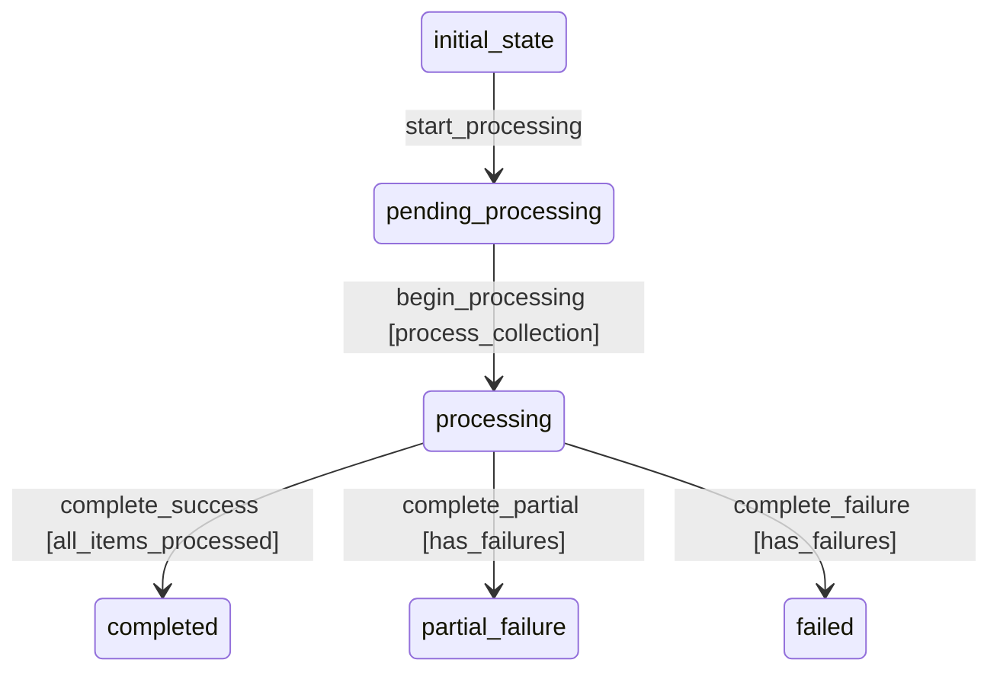

# HNItemCollection Workflow Requirements

## Workflow States
1. **initial_state**: Starting point for new collections
2. **pending_processing**: Collection awaits processing
3. **processing**: Items being processed
4. **completed**: All items processed successfully
5. **partial_failure**: Some items failed processing
6. **failed**: Collection processing failed

## Transitions
- **start_processing**: initial_state → pending_processing (automatic)
- **begin_processing**: pending_processing → processing (manual, with processor)
- **complete_success**: processing → completed (automatic, with criteria)
- **complete_partial**: processing → partial_failure (automatic, with criteria)
- **complete_failure**: processing → failed (automatic, with criteria)

## Processors
1. **process_collection**: Processes all items in the collection
2. **fetch_from_firebase**: Fetches items from Firebase HN API

## Criteria
1. **all_items_processed**: Checks if all items processed successfully
2. **has_failures**: Checks if any items failed processing

## Workflow Diagram

## Processor Details

### process_collection
- **Purpose**: Process all items in the collection
- **Input**: Collection entity with items
- **Process**: Validate, create, and index individual HN items
- **Output**: Updated collection with processing results

### fetch_from_firebase
- **Purpose**: Fetch items from Firebase HN API
- **Input**: Collection with API parameters
- **Process**: Call Firebase API, retrieve items, populate collection
- **Output**: Collection populated with fetched items

## Criteria Details

### all_items_processed
- **Purpose**: Check if all items processed successfully
- **Check**: processed_items == total_items AND failed_items == 0
- **Returns**: Boolean indicating complete success

### has_failures
- **Purpose**: Check if any items failed processing
- **Check**: failed_items > 0
- **Returns**: Boolean indicating presence of failures
