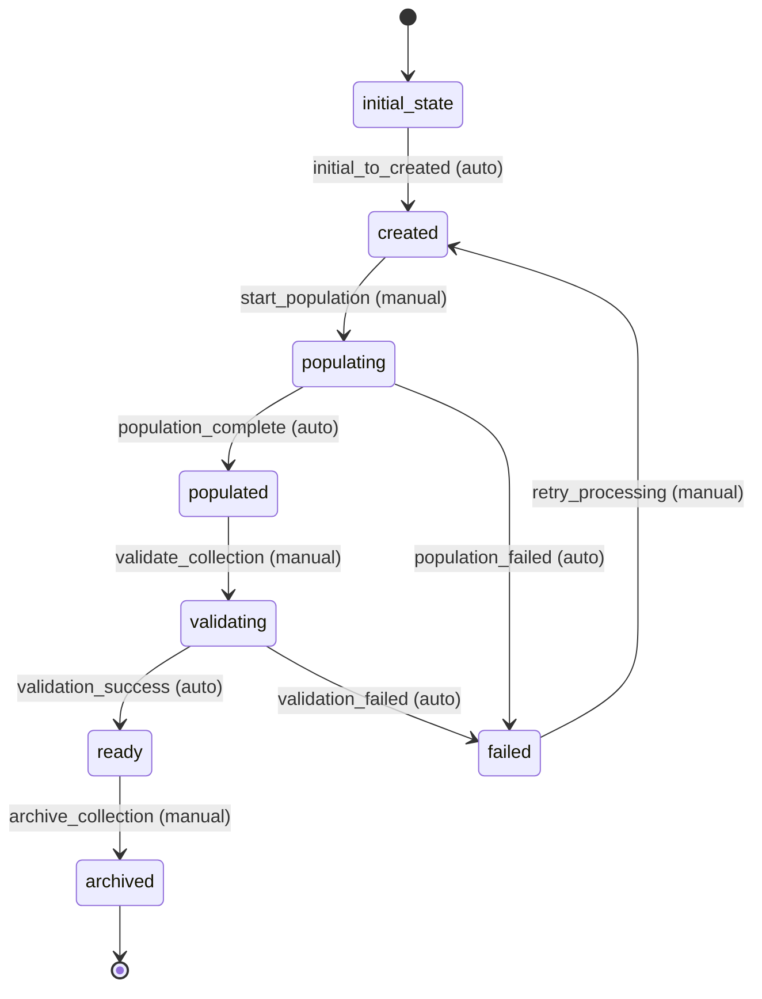

# HN Items Collection Workflow

## Overview
The HN Items Collection workflow manages the lifecycle of collections containing multiple Hacker News items. It handles collection creation, population with items, validation, and maintenance operations.

## Workflow States

### 1. initial_state
- **Description**: Starting state for all new collections
- **Entry Condition**: Collection is created
- **Exit Condition**: Automatic transition to created state

### 2. created
- **Description**: Collection has been created but is empty
- **Entry Condition**: Collection metadata is initialized
- **Exit Condition**: Collection is ready for population

### 3. populating
- **Description**: Collection is being populated with items
- **Entry Condition**: Population process has started
- **Exit Condition**: All items have been added or population fails

### 4. populated
- **Description**: Collection has been populated with items
- **Entry Condition**: All items have been successfully added
- **Exit Condition**: Collection is ready for validation

### 5. validating
- **Description**: Collection and its items are being validated
- **Entry Condition**: Population is complete and validation starts
- **Exit Condition**: Validation completes successfully or fails

### 6. ready
- **Description**: Collection is validated and ready for use
- **Entry Condition**: All validation checks pass
- **Exit Condition**: Collection may be archived or updated

### 7. archived
- **Description**: Collection has been archived
- **Entry Condition**: Archive operation is requested
- **Exit Condition**: Collection is preserved but read-only

### 8. failed
- **Description**: Collection processing has failed
- **Entry Condition**: Population or validation failed
- **Exit Condition**: Manual intervention or retry

## Workflow Transitions

### 1. initial_to_created
- **From**: initial_state
- **To**: created
- **Type**: Automatic
- **Trigger**: Collection creation
- **Processors**: None
- **Criteria**: None

### 2. start_population
- **From**: created
- **To**: populating
- **Type**: Manual
- **Trigger**: Population request
- **Processors**: initialize_population_processor
- **Criteria**: None

### 3. population_complete
- **From**: populating
- **To**: populated
- **Type**: Automatic
- **Trigger**: All items added
- **Processors**: finalize_population_processor
- **Criteria**: population_complete_criterion

### 4. population_failed
- **From**: populating
- **To**: failed
- **Type**: Automatic
- **Trigger**: Population failure
- **Processors**: handle_population_failure_processor
- **Criteria**: population_failed_criterion

### 5. validate_collection
- **From**: populated
- **To**: validating
- **Type**: Manual
- **Trigger**: Validation request
- **Processors**: validate_collection_processor
- **Criteria**: None

### 6. validation_success
- **From**: validating
- **To**: ready
- **Type**: Automatic
- **Trigger**: Validation success
- **Processors**: finalize_collection_processor
- **Criteria**: validation_success_criterion

### 7. validation_failed
- **From**: validating
- **To**: failed
- **Type**: Automatic
- **Trigger**: Validation failure
- **Processors**: handle_validation_failure_processor
- **Criteria**: validation_failed_criterion

### 8. archive_collection
- **From**: ready
- **To**: archived
- **Type**: Manual
- **Trigger**: Archive request
- **Processors**: archive_collection_processor
- **Criteria**: None

### 9. retry_processing
- **From**: failed
- **To**: created
- **Type**: Manual
- **Trigger**: Retry request
- **Processors**: reset_collection_processor
- **Criteria**: retry_allowed_criterion

## Workflow Diagram



## Processors

### 1. initialize_population_processor
- **Entity**: HnItemsCollection
- **Purpose**: Initialize the population process for the collection
- **Input**: Empty collection entity
- **Output**: Collection ready for population
- **Pseudocode**:
```
process(entity):
    entity.population_started_at = current_timestamp()
    entity.population_status = "in_progress"
    entity.processed_items = 0
    entity.failed_items = 0
    entity.item_ids = []
    
    // Initialize progress tracking
    entity.population_progress = {
        "total_expected": entity.total_items or 0,
        "processed": 0,
        "failed": 0,
        "start_time": current_timestamp()
    }
    
    return entity
```

### 2. finalize_population_processor
- **Entity**: HnItemsCollection
- **Purpose**: Finalize the population process
- **Input**: Collection with populated items
- **Output**: Collection with finalized population
- **Pseudocode**:
```
process(entity):
    entity.population_completed_at = current_timestamp()
    entity.population_status = "completed"
    entity.item_count = len(entity.item_ids)
    
    // Calculate population statistics
    entity.population_stats = {
        "total_items": entity.item_count,
        "processing_time": entity.population_completed_at - entity.population_started_at,
        "success_rate": (entity.processed_items / entity.total_items) * 100 if entity.total_items > 0 else 0
    }
    
    // Update collection metadata
    entity.updated_at = current_timestamp()
    
    return entity
```

### 3. handle_population_failure_processor
- **Entity**: HnItemsCollection
- **Purpose**: Handle population failures
- **Input**: Collection with population failure
- **Output**: Collection with failure information
- **Pseudocode**:
```
process(entity):
    entity.population_status = "failed"
    entity.population_failed_at = current_timestamp()
    entity.failure_reason = "population_failed"
    
    // Log failure details
    log_error(f"Collection {entity.collection_id} population failed", {
        "processed_items": entity.processed_items,
        "failed_items": entity.failed_items,
        "total_expected": entity.total_items
    })
    
    return entity
```

### 4. validate_collection_processor
- **Entity**: HnItemsCollection
- **Purpose**: Validate collection and its items
- **Input**: Populated collection
- **Output**: Collection with validation results
- **Pseudocode**:
```
process(entity):
    validation_errors = []
    
    // Validate collection metadata
    if not entity.name:
        validation_errors.append("Collection name is required")
    if not entity.collection_type:
        validation_errors.append("Collection type is required")
    
    // Validate item references
    invalid_items = []
    for item_id in entity.item_ids:
        if not item_exists(item_id):
            invalid_items.append(item_id)
    
    if invalid_items:
        validation_errors.append(f"Invalid item references: {invalid_items}")
    
    // Validate collection constraints
    if entity.item_count != len(entity.item_ids):
        validation_errors.append("Item count mismatch")
    
    entity.validation_errors = validation_errors
    entity.validation_status = "passed" if not validation_errors else "failed"
    entity.validated_at = current_timestamp()
    
    return entity
```

### 5. finalize_collection_processor
- **Entity**: HnItemsCollection
- **Purpose**: Finalize collection after successful validation
- **Input**: Validated collection
- **Output**: Ready collection
- **Pseudocode**:
```
process(entity):
    entity.status = "active"
    entity.finalized_at = current_timestamp()
    
    // Update search index
    update_collection_search_index(entity)
    
    // Generate collection statistics
    entity.statistics = generate_collection_statistics(entity)
    
    // Trigger notifications
    notify_collection_ready(entity)
    
    return entity
```

### 6. handle_validation_failure_processor
- **Entity**: HnItemsCollection
- **Purpose**: Handle validation failures
- **Input**: Collection with validation failure
- **Output**: Collection with failure handling
- **Pseudocode**:
```
process(entity):
    entity.failure_reason = "validation_failed"
    entity.failure_details = entity.validation_errors
    entity.failed_at = current_timestamp()
    
    log_error(f"Collection {entity.collection_id} validation failed", entity.validation_errors)
    
    return entity
```

### 7. archive_collection_processor
- **Entity**: HnItemsCollection
- **Purpose**: Archive the collection
- **Input**: Ready collection
- **Output**: Archived collection
- **Pseudocode**:
```
process(entity):
    entity.status = "archived"
    entity.archived_at = current_timestamp()
    entity.archived_by = get_current_user()
    
    // Remove from active indexes but preserve data
    remove_from_active_search_index(entity)
    
    // Create archive record
    create_archive_record(entity)
    
    return entity
```

### 8. reset_collection_processor
- **Entity**: HnItemsCollection
- **Purpose**: Reset collection for retry
- **Input**: Failed collection
- **Output**: Reset collection
- **Pseudocode**:
```
process(entity):
    // Clear failure information
    entity.validation_errors = []
    entity.failure_reason = None
    entity.failure_details = None
    
    // Reset status
    entity.validation_status = None
    entity.population_status = None
    
    // Clear item data for fresh start
    entity.item_ids = []
    entity.processed_items = 0
    entity.failed_items = 0
    entity.item_count = 0
    
    entity.reset_at = current_timestamp()
    
    return entity
```

## Criteria

### 1. population_complete_criterion
- **Purpose**: Check if population is complete
- **Pseudocode**:
```
check(entity):
    return (entity.population_status == "completed" and 
            entity.processed_items > 0 and
            entity.item_count == len(entity.item_ids))
```

### 2. population_failed_criterion
- **Purpose**: Check if population failed
- **Pseudocode**:
```
check(entity):
    return (entity.population_status == "failed" or
            entity.failed_items > entity.processed_items or
            (entity.total_items > 0 and entity.processed_items == 0))
```

### 3. validation_success_criterion
- **Purpose**: Check if validation was successful
- **Pseudocode**:
```
check(entity):
    return (entity.validation_status == "passed" and 
            not entity.validation_errors and
            entity.item_count > 0)
```

### 4. validation_failed_criterion
- **Purpose**: Check if validation failed
- **Pseudocode**:
```
check(entity):
    return (entity.validation_status == "failed" or 
            entity.validation_errors)
```

### 5. retry_allowed_criterion
- **Purpose**: Check if retry is allowed
- **Pseudocode**:
```
check(entity):
    max_retries = 3
    retry_count = entity.retry_count or 0
    return (retry_count < max_retries and 
            entity.failure_reason in ["population_failed", "validation_failed"])
```
