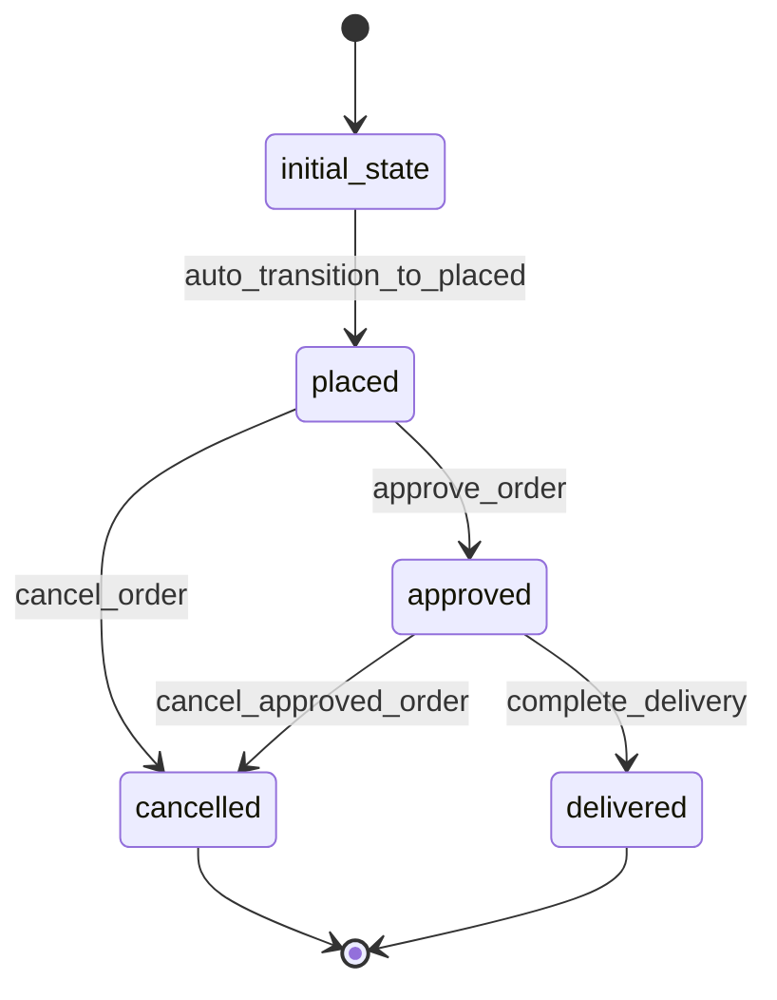

# Order Workflow

## Workflow States



## State Transitions

### 1. initial_state → placed
- **Transition**: auto_transition_to_placed
- **Type**: Automatic
- **Processor**: CreateOrderProcessor
- **Purpose**: Initialize new order

### 2. placed → approved
- **Transition**: approve_order
- **Type**: Manual
- **Processor**: ApproveOrderProcessor
- **Criterion**: ValidOrderCriterion
- **Purpose**: Approve order for processing

### 3. approved → delivered
- **Transition**: complete_delivery
- **Type**: Manual
- **Processor**: CompleteDeliveryProcessor
- **Purpose**: Mark order as delivered

### 4. placed → cancelled
- **Transition**: cancel_order
- **Type**: Manual
- **Purpose**: Cancel order before approval

### 5. approved → cancelled
- **Transition**: cancel_approved_order
- **Type**: Manual
- **Purpose**: Cancel approved order (with refund)

## Processors

### CreateOrderProcessor
- **Entity**: Order
- **Input**: Order data with petId, userId, quantity
- **Purpose**: Create and validate new order
- **Output**: Order ready for approval
- **Pseudocode**:
```
process(entity):
    validate_pet_availability(entity.petId)
    calculate_total_amount(entity)
    entity.orderDate = current_timestamp()
    entity.estimatedDelivery = current_timestamp() + 7_days
    reserve_pet(entity.petId)
```

### ApproveOrderProcessor
- **Entity**: Order
- **Input**: Order entity with approval details
- **Purpose**: Process payment and approve order
- **Output**: Approved order ready for shipping
- **Pseudocode**:
```
process(entity):
    process_payment(entity.totalAmount, entity.userId)
    entity.approvedAt = current_timestamp()
    entity.trackingNumber = generate_tracking_number()
    send_notification("Order approved", entity.id)
```

### CompleteDeliveryProcessor
- **Entity**: Order
- **Input**: Order entity with delivery confirmation
- **Purpose**: Mark order as delivered and complete
- **Output**: Completed order
- **Pseudocode**:
```
process(entity):
    entity.deliveredAt = current_timestamp()
    entity.complete = true
    update_pet_status_to_sold(entity.petId)
    send_notification("Order delivered", entity.id)
```

## Criteria

### ValidOrderCriterion
- **Purpose**: Validate order before approval
- **Pseudocode**:
```
check(entity):
    return entity.petId != null AND
           entity.userId != null AND
           entity.quantity > 0 AND
           entity.totalAmount > 0
```
