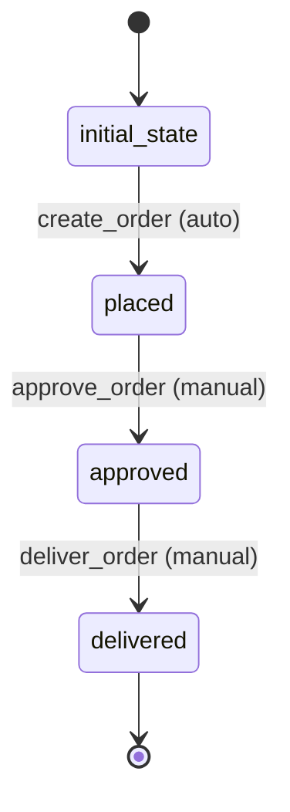

# Order Workflow

## Workflow States and Transitions

### States:
- `initial_state`: Starting state
- `placed`: Order has been placed
- `approved`: Order has been approved for processing
- `delivered`: Order has been delivered

### Transitions:



### Workflow Rules:
- Initial transition from `initial_state` to `placed` is automatic
- All other transitions are manual
- No loop transitions - linear progression

## Processors

### CreateOrderProcessor
- **Entity**: Order
- **Purpose**: Initialize order and validate pet availability
- **Input**: Order entity with petId and quantity
- **Output**: Order entity with placed status
- **Pseudocode**:
```
process(entity):
    validate_pet_exists(entity.petId)
    validate_pet_available(entity.petId)
    entity.status = "placed"
    entity.orderDate = current_timestamp()
    entity.complete = false
    return entity
```

### ApproveOrderProcessor
- **Entity**: Order
- **Purpose**: Approve order for processing and reserve pet
- **Input**: Order entity in placed state
- **Output**: Order entity with approved status
- **Pseudocode**:
```
process(entity):
    if entity.status != "placed":
        throw error("Order not in placed state")
    reserve_pet(entity.petId)
    entity.status = "approved"
    entity.approvedAt = current_timestamp()
    return entity
```

### DeliverOrderProcessor
- **Entity**: Order
- **Purpose**: Mark order as delivered and complete sale
- **Input**: Order entity in approved state
- **Output**: Order entity with delivered status
- **Pseudocode**:
```
process(entity):
    if entity.status != "approved":
        throw error("Order not approved")
    complete_pet_sale(entity.petId)
    entity.status = "delivered"
    entity.deliveredAt = current_timestamp()
    entity.complete = true
    return entity
```

## Criteria

### OrderValidityCriterion
- **Purpose**: Check if order data is valid
- **Pseudocode**:
```
check(entity):
    return entity.petId != null and entity.quantity > 0
```
