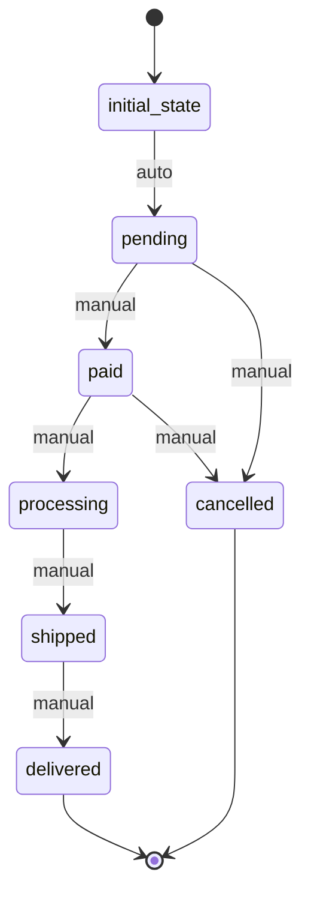

# Order Workflow

## States
- **initial_state**: Starting state
- **pending**: Order created, awaiting payment
- **paid**: Payment processed successfully
- **processing**: Order being prepared for delivery
- **shipped**: Order shipped to customer
- **delivered**: Order delivered successfully
- **cancelled**: Order cancelled

## Transitions
- **initial_state → pending**: Automatic transition when order created
- **pending → paid**: Manual transition after payment processing
- **paid → processing**: Manual transition when order preparation starts
- **processing → shipped**: Manual transition when order ships
- **shipped → delivered**: Manual transition when delivery confirmed
- **pending → cancelled**: Manual transition for cancellation
- **paid → cancelled**: Manual transition for refund

## Processors

### ProcessPayment
- **Entity**: Order
- **Input**: Order with payment details
- **Purpose**: Process payment for the order
- **Output**: Order with payment status
- **Pseudocode**:
```
process():
  validate payment method
  charge payment amount
  update payment status
  reserve pet if payment successful
  return updated entity
```

### UpdatePetAvailability
- **Entity**: Order
- **Input**: Completed order
- **Purpose**: Mark pet as unavailable when order completes
- **Output**: Order with pet status updated
- **Pseudocode**:
```
process():
  find pet by petId
  update pet.isAvailable = false
  trigger pet state transition to "adopted"
  return updated entity
```

### CalculateDelivery
- **Entity**: Order
- **Input**: Order with delivery address
- **Purpose**: Calculate delivery date and logistics
- **Output**: Order with delivery information
- **Pseudocode**:
```
process():
  calculate delivery time based on address
  set estimatedDeliveryDate
  assign delivery method
  return updated entity
```

## Criteria

### HasValidPayment
- **Purpose**: Check if order has valid payment information
- **Pseudocode**:
```
check():
  return entity.paymentMethod is not null and entity.totalAmount > 0
```

## Workflow Diagram

