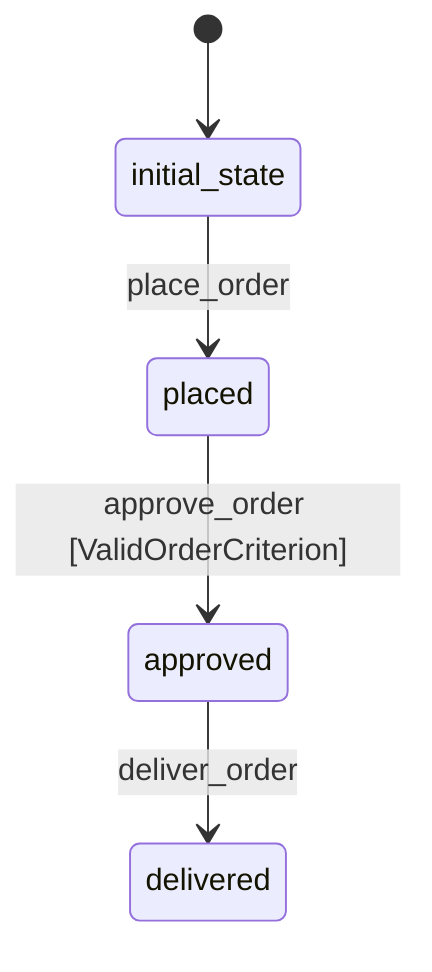

# Order Workflow

## Description
Manages the lifecycle of pet orders from placement to delivery.

## States
- **initial_state**: Starting point
- **placed**: Order has been placed
- **approved**: Order has been approved for processing
- **delivered**: Order has been delivered

## Transitions

### initial_state → placed
- **Name**: place_order
- **Type**: Automatic
- **Processor**: PlaceOrderProcessor

### placed → approved
- **Name**: approve_order
- **Type**: Manual
- **Processor**: ApproveOrderProcessor
- **Criterion**: ValidOrderCriterion

### approved → delivered
- **Name**: deliver_order
- **Type**: Manual
- **Processor**: DeliverOrderProcessor

## Processors

### PlaceOrderProcessor
- **Entity**: Order
- **Input**: Order data
- **Purpose**: Initialize order placement
- **Output**: Order with placed status
- **Pseudocode**:
```
process(entity):
    entity.order_date = current_timestamp()
    entity.estimated_delivery = calculate_delivery_date()
    reserve_pet(entity.pet_id)
    return entity
```

### ApproveOrderProcessor
- **Entity**: Order
- **Input**: Order entity
- **Purpose**: Approve order for processing
- **Output**: Order with approved status
- **Pseudocode**:
```
process(entity):
    entity.approval_date = current_timestamp()
    entity.approved_by = current_user()
    return entity
```

### DeliverOrderProcessor
- **Entity**: Order
- **Input**: Order entity
- **Purpose**: Mark order as delivered
- **Output**: Order with delivered status
- **Pseudocode**:
```
process(entity):
    entity.delivery_date = current_timestamp()
    complete_pet_sale(entity.pet_id)
    return entity
```

## Criteria

### ValidOrderCriterion
- **Purpose**: Validate order before approval
- **Pseudocode**:
```
check(entity):
    if entity.pet_id is null:
        return false
    if entity.user_id is null:
        return false
    if entity.total_amount <= 0:
        return false
    return true
```

## Mermaid State Diagram

```mermaid
stateDiagram-v2
    [*] --> initial_state
    initial_state --> placed : place_order
    placed --> approved : approve_order [ValidOrderCriterion]
    approved --> delivered : deliver_order
```
