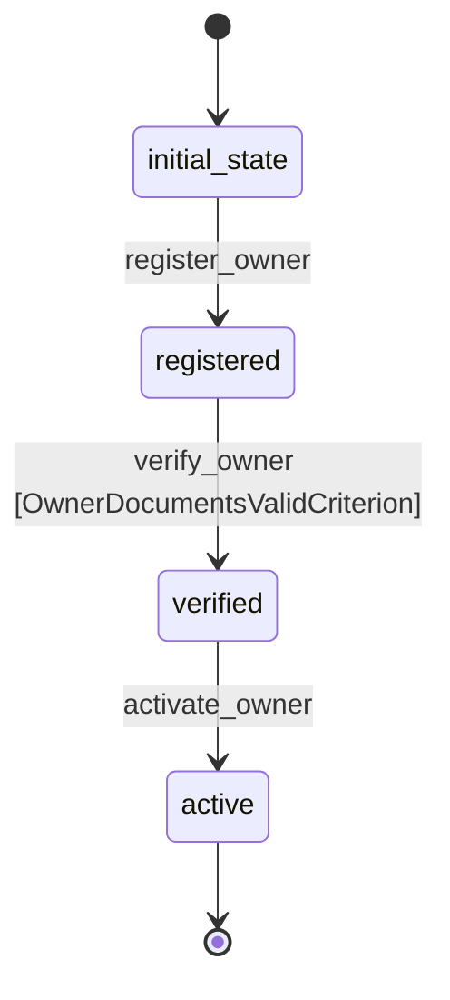

# Owner Workflow

## States
- **initial_state**: Starting state for new owners
- **registered**: Owner has registered but not verified
- **verified**: Owner has been verified and can adopt pets
- **active**: Owner is actively adopting or has adopted pets

## Transitions

### initial_state → registered
- **Name**: register_owner
- **Type**: Automatic
- **Processor**: RegisterOwnerProcessor
- **Purpose**: Register new owner in the system

### registered → verified
- **Name**: verify_owner
- **Type**: Manual
- **Processor**: VerifyOwnerProcessor
- **Criterion**: OwnerDocumentsValidCriterion
- **Purpose**: Verify owner eligibility for pet adoption

### verified → active
- **Name**: activate_owner
- **Type**: Manual
- **Processor**: ActivateOwnerProcessor
- **Purpose**: Activate owner when they start adoption process

## Processors

### RegisterOwnerProcessor
- **Input**: Owner entity data
- **Purpose**: Register new owner and validate basic information
- **Output**: Owner registered in system
- **Pseudocode**:
```
process(entity):
    entity.registration_date = current_timestamp()
    entity.status = "registered"
    validate_contact_info(entity)
    send_welcome_email(entity.email)
    return entity
```

### VerifyOwnerProcessor
- **Input**: Owner entity with verification documents
- **Purpose**: Verify owner eligibility for adoption
- **Output**: Owner verified for adoption
- **Pseudocode**:
```
process(entity):
    entity.verification_date = current_timestamp()
    entity.status = "verified"
    entity.can_adopt = true
    send_verification_confirmation(entity.email)
    return entity
```

### ActivateOwnerProcessor
- **Input**: Verified owner entity
- **Purpose**: Activate owner for adoption activities
- **Output**: Owner activated for adoptions
- **Pseudocode**:
```
process(entity):
    entity.activation_date = current_timestamp()
    entity.status = "active"
    return entity
```

## Criteria

### OwnerDocumentsValidCriterion
- **Purpose**: Check if owner has provided valid verification documents
- **Pseudocode**:
```
check(entity):
    return entity.verification_documents is not null and 
           entity.verification_documents != ""
```

## Mermaid State Diagram

