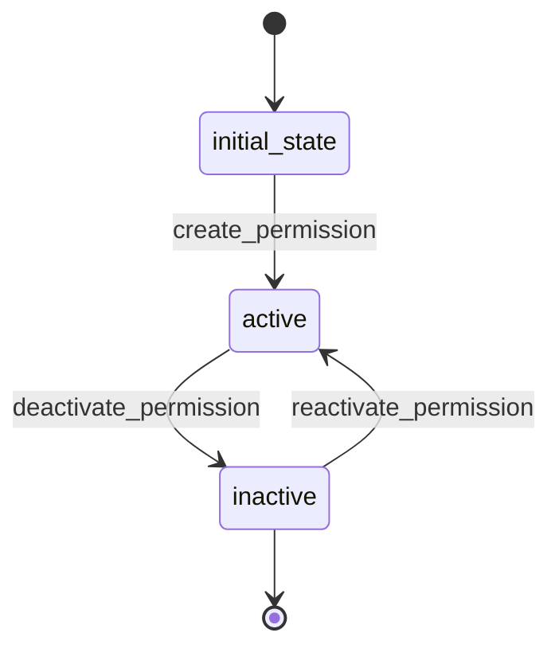

# Permission Workflow

## States
- **initial_state**: Starting point
- **active**: Permission is active and can be assigned
- **inactive**: Permission is disabled

## Transitions

### initial_state → active
- **Name**: create_permission
- **Type**: Automatic
- **Processor**: CreatePermissionProcessor
- **Description**: Creates and activates permission

### active → inactive
- **Name**: deactivate_permission
- **Type**: Manual
- **Processor**: DeactivatePermissionProcessor
- **Description**: Deactivates permission

### inactive → active
- **Name**: reactivate_permission
- **Type**: Manual
- **Processor**: ReactivatePermissionProcessor
- **Description**: Reactivates permission

## Processors

### CreatePermissionProcessor
- **Purpose**: Initialize permission with active status
- **Input**: Permission entity data
- **Output**: Active permission
- **Pseudocode**:
```
process(entity):
    entity.is_active = true
    entity.created_at = current_timestamp()
    validate_resource_action_combination(entity.resource, entity.action)
```

### DeactivatePermissionProcessor
- **Purpose**: Disable permission from role assignment
- **Input**: Permission entity
- **Output**: Inactive permission
- **Pseudocode**:
```
process(entity):
    entity.is_active = false
    entity.deactivated_at = current_timestamp()
    remove_from_roles(entity.id)
```

### ReactivatePermissionProcessor
- **Purpose**: Reactivate permission for role assignment
- **Input**: Permission entity
- **Output**: Active permission
- **Pseudocode**:
```
process(entity):
    entity.is_active = true
    entity.reactivated_at = current_timestamp()
```

## Mermaid State Diagram

