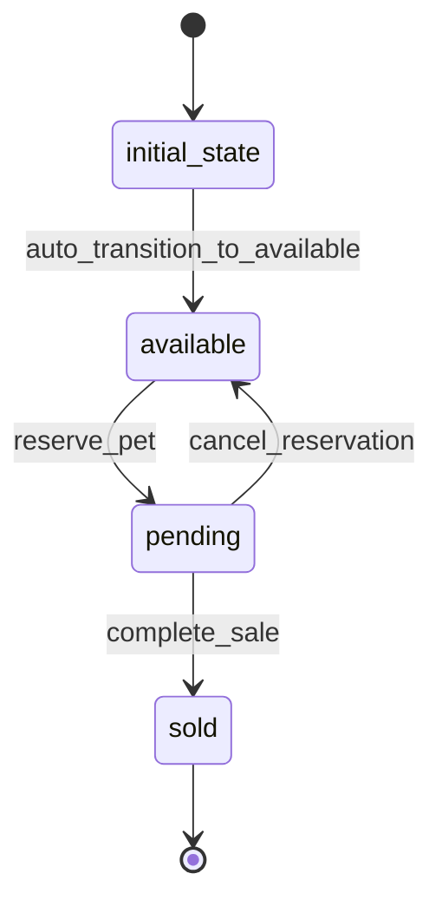

# Pet Workflow

## Workflow States



## State Transitions

### 1. initial_state → available
- **Transition**: auto_transition_to_available
- **Type**: Automatic
- **Processor**: InitializePetProcessor
- **Purpose**: Set up new pet in the system

### 2. available → pending
- **Transition**: reserve_pet
- **Type**: Manual
- **Processor**: ReservePetProcessor
- **Purpose**: Reserve pet for potential buyer

### 3. pending → sold
- **Transition**: complete_sale
- **Type**: Manual
- **Processor**: CompleteSaleProcessor
- **Purpose**: Finalize pet sale

### 4. pending → available
- **Transition**: cancel_reservation
- **Type**: Manual
- **Purpose**: Cancel reservation and make pet available again

## Processors

### InitializePetProcessor
- **Entity**: Pet
- **Input**: Pet data with basic information
- **Purpose**: Initialize pet with default values and validate data
- **Output**: Pet entity ready for listing
- **Pseudocode**:
```
process(entity):
    validate_required_fields(entity.name, entity.photoUrls)
    set_default_values(entity)
    entity.dateAdded = current_timestamp()
    entity.viewCount = 0
```

### ReservePetProcessor
- **Entity**: Pet
- **Input**: Pet entity with reservation details
- **Purpose**: Reserve pet for a potential buyer
- **Output**: Pet marked as pending with reservation info
- **Pseudocode**:
```
process(entity):
    entity.reservedAt = current_timestamp()
    entity.reservationExpiry = current_timestamp() + 24_hours
    send_notification("Pet reserved", entity.id)
```

### CompleteSaleProcessor
- **Entity**: Pet
- **Input**: Pet entity with sale completion data
- **Purpose**: Mark pet as sold and update inventory
- **Output**: Pet marked as sold, inventory updated
- **Pseudocode**:
```
process(entity):
    entity.soldAt = current_timestamp()
    entity.soldPrice = entity.price
    update_inventory_count()
    send_notification("Pet sold", entity.id)
```

## Criteria

### ValidPetCriterion
- **Purpose**: Validate pet data before state transitions
- **Pseudocode**:
```
check(entity):
    return entity.name != null AND 
           entity.photoUrls.length > 0 AND
           entity.price > 0
```
