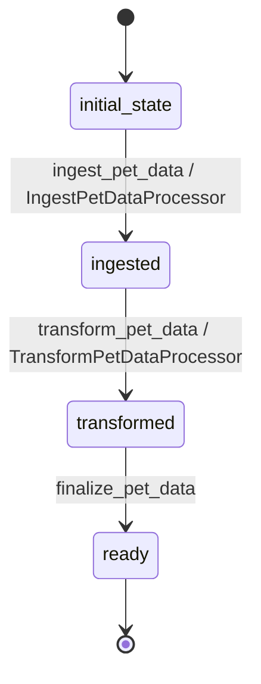

# Pet Workflow

## Description
Manages the lifecycle of pet data from external API ingestion through transformation to display-ready state.

## States
- **initial_state**: Starting point for new pet entities
- **ingested**: Raw pet data retrieved from external API
- **transformed**: Data converted to user-friendly format
- **ready**: Pet data ready for display to users

## Transitions

### initial_state → ingested
- **Name**: ingest_pet_data
- **Type**: Automatic
- **Processor**: IngestPetDataProcessor
- **Description**: Fetch raw pet data from external Petstore API

### ingested → transformed  
- **Name**: transform_pet_data
- **Type**: Automatic
- **Processor**: TransformPetDataProcessor
- **Description**: Convert raw API data to user-friendly format

### transformed → ready
- **Name**: finalize_pet_data
- **Type**: Automatic
- **Description**: Mark pet data as ready for display

## Processors

### IngestPetDataProcessor
- **Entity**: Pet
- **Input**: Pet search parameters from external trigger
- **Purpose**: Retrieve raw pet data from Petstore API
- **Output**: Raw pet data stored in entity
- **Pseudocode**:
```
process():
    api_url = construct_petstore_api_url(entity.search_params)
    raw_data = fetch_from_external_api(api_url)
    entity.raw_data = raw_data
    entity.ingestion_timestamp = current_timestamp()
```

### TransformPetDataProcessor  
- **Entity**: Pet
- **Input**: Raw pet data from API
- **Purpose**: Transform data to user-friendly format
- **Output**: Transformed pet data with renamed fields
- **Pseudocode**:
```
process():
    raw = entity.raw_data
    entity.name = raw.petName or raw.name
    entity.species = extract_species(raw)
    entity.status = raw.status
    entity.categoryId = raw.category.id if raw.category else null
    entity.categoryName = raw.category.name if raw.category else null
    entity.availabilityStatus = format_availability_status(raw.status)
    entity.photoUrls = raw.photoUrls or []
    entity.tags = extract_tags(raw.tags)
    entity.transformation_timestamp = current_timestamp()
```

## Mermaid State Diagram

