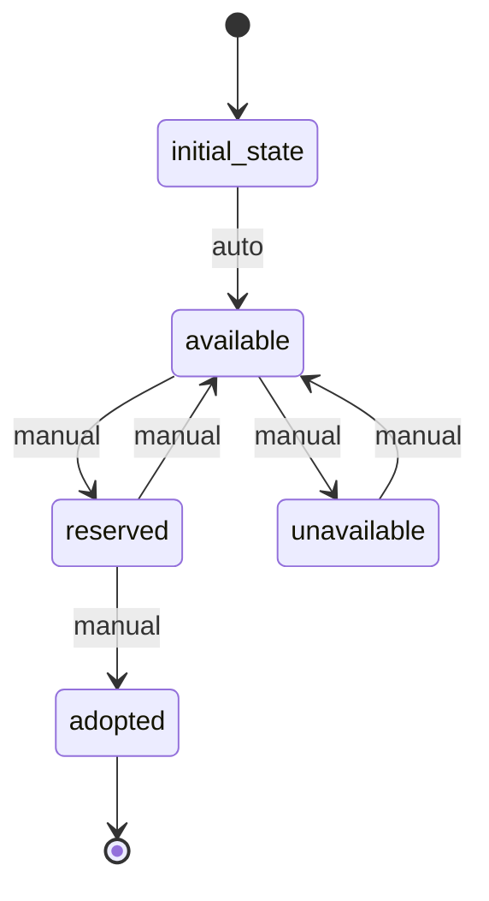

# Pet Workflow

## States
- **initial_state**: Starting state
- **available**: Pet is available for adoption/sale
- **reserved**: Pet is reserved by a customer
- **adopted**: Pet has been adopted/sold
- **unavailable**: Pet is temporarily unavailable

## Transitions
- **initial_state → available**: Automatic transition when pet is added
- **available → reserved**: Manual transition when customer reserves pet
- **reserved → adopted**: Manual transition when adoption is completed
- **reserved → available**: Manual transition when reservation is cancelled
- **available → unavailable**: Manual transition for health/other issues
- **unavailable → available**: Manual transition when issues resolved

## Processors

### ValidatePetInfo
- **Entity**: Pet
- **Input**: Pet data
- **Purpose**: Validate pet information and health status
- **Output**: Updated pet with validation status
- **Pseudocode**:
```
process():
  validate required fields (name, species, age)
  check health status is valid
  set validation timestamp
  return updated entity
```

### UpdateAvailability
- **Entity**: Pet
- **Input**: Pet data with availability change
- **Purpose**: Update pet availability status
- **Output**: Pet with updated availability
- **Pseudocode**:
```
process():
  update isAvailable field
  log availability change
  notify interested customers if becoming available
  return updated entity
```

## Criteria

### IsHealthy
- **Purpose**: Check if pet is healthy enough for adoption
- **Pseudocode**:
```
check():
  return entity.healthStatus == "healthy" or entity.healthStatus == "vaccinated"
```

## Workflow Diagram

