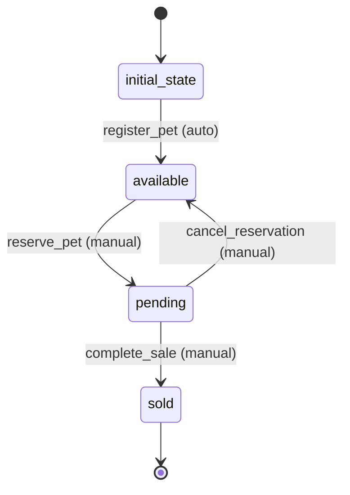

# Pet Workflow

## Workflow States and Transitions

### States:
- `initial_state`: Starting state
- `available`: Pet is available for purchase
- `pending`: Pet is reserved/pending purchase
- `sold`: Pet has been sold

### Transitions:



### Workflow Rules:
- Initial transition from `initial_state` to `available` is automatic
- All other transitions are manual
- Loop transitions (pending → available) are manual

## Processors

### RegisterPetProcessor
- **Entity**: Pet
- **Purpose**: Initialize pet data and set availability
- **Input**: Pet entity with basic information
- **Output**: Pet entity with validated data and available status
- **Pseudocode**:
```
process(entity):
    validate_pet_data(entity)
    set_default_values(entity)
    entity.status = "available"
    entity.meta.state = "available"
    return entity
```

### ReservePetProcessor
- **Entity**: Pet
- **Purpose**: Reserve pet for potential purchase
- **Input**: Pet entity in available state
- **Output**: Pet entity with pending status
- **Pseudocode**:
```
process(entity):
    if entity.status != "available":
        throw error("Pet not available for reservation")
    entity.status = "pending"
    entity.reservedAt = current_timestamp()
    return entity
```

### CompleteSaleProcessor
- **Entity**: Pet
- **Purpose**: Mark pet as sold and finalize sale
- **Input**: Pet entity in pending state
- **Output**: Pet entity with sold status
- **Pseudocode**:
```
process(entity):
    if entity.status != "pending":
        throw error("Pet not in pending state")
    entity.status = "sold"
    entity.soldAt = current_timestamp()
    return entity
```

## Criteria

### PetAvailabilityCriterion
- **Purpose**: Check if pet is available for operations
- **Pseudocode**:
```
check(entity):
    return entity.status == "available"
```
