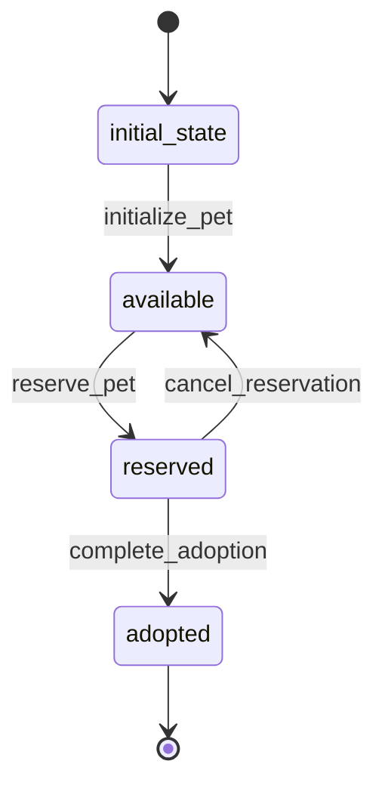

# Pet Workflow

## States
- **initial_state**: Starting state for new pets
- **available**: Pet is available for adoption
- **reserved**: Pet is reserved during adoption process
- **adopted**: Pet has been successfully adopted

## Transitions

### initial_state → available
- **Name**: initialize_pet
- **Type**: Automatic
- **Processor**: InitializePetProcessor
- **Purpose**: Set up new pet in the system

### available → reserved
- **Name**: reserve_pet
- **Type**: Manual
- **Processor**: ReservePetProcessor
- **Purpose**: Reserve pet when adoption process starts

### reserved → adopted
- **Name**: complete_adoption
- **Type**: Manual
- **Processor**: CompleteAdoptionProcessor
- **Purpose**: Finalize pet adoption

### reserved → available
- **Name**: cancel_reservation
- **Type**: Manual
- **Processor**: CancelReservationProcessor
- **Purpose**: Return pet to available status if adoption cancelled

## Processors

### InitializePetProcessor
- **Input**: Pet entity data
- **Purpose**: Initialize pet status and validate data
- **Output**: Pet ready for adoption
- **Pseudocode**:
```
process(entity):
    entity.status = "available"
    entity.date_added = current_timestamp()
    validate_pet_data(entity)
    return entity
```

### ReservePetProcessor
- **Input**: Pet entity with adoption details
- **Purpose**: Reserve pet for specific adoption
- **Output**: Pet marked as reserved
- **Pseudocode**:
```
process(entity):
    entity.status = "reserved"
    entity.reserved_date = current_timestamp()
    entity.reservation_expires = current_timestamp() + 7_days
    return entity
```

### CompleteAdoptionProcessor
- **Input**: Pet entity with completed adoption
- **Purpose**: Finalize pet adoption
- **Output**: Pet marked as adopted
- **Pseudocode**:
```
process(entity):
    entity.status = "adopted"
    entity.adoption_date = current_timestamp()
    entity.available_for_adoption = false
    return entity
```

## Mermaid State Diagram

```mermaid
stateDiagram-v2
    [*] --> initial_state
    initial_state --> available : initialize_pet
    available --> reserved : reserve_pet
    reserved --> adopted : complete_adoption
    reserved --> available : cancel_reservation
    adopted --> [*]
```
