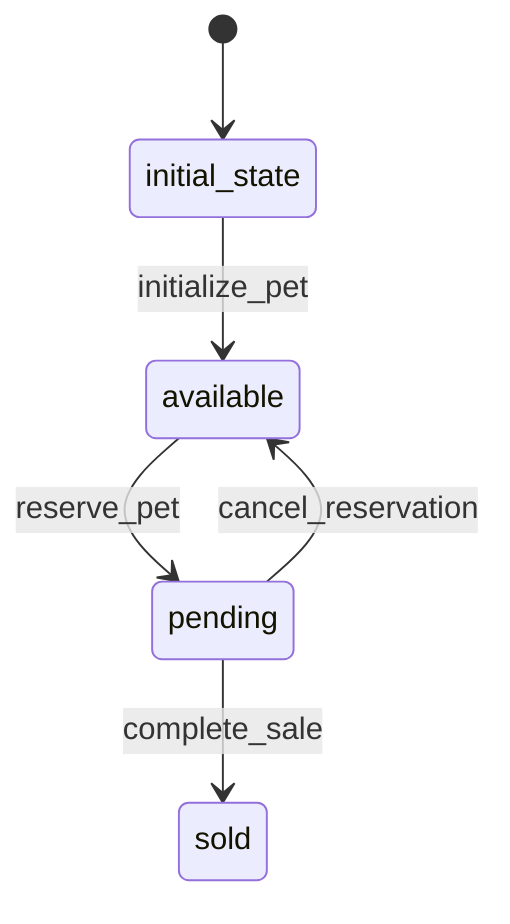

# Pet Workflow

## Description
Manages the lifecycle of pets in the store from availability to sale.

## States
- **initial_state**: Starting point
- **available**: Pet is available for purchase
- **pending**: Pet is reserved/pending sale
- **sold**: Pet has been sold

## Transitions

### initial_state → available
- **Name**: initialize_pet
- **Type**: Automatic
- **Processor**: InitializePetProcessor

### available → pending
- **Name**: reserve_pet
- **Type**: Manual
- **Processor**: ReservePetProcessor

### pending → sold
- **Name**: complete_sale
- **Type**: Manual
- **Processor**: CompleteSaleProcessor

### pending → available
- **Name**: cancel_reservation
- **Type**: Manual
- **Processor**: CancelReservationProcessor

## Processors

### InitializePetProcessor
- **Entity**: Pet
- **Input**: Pet data
- **Purpose**: Initialize pet as available
- **Output**: Pet with available status
- **Pseudocode**:
```
process(entity):
    entity.availability_date = current_timestamp()
    entity.last_updated = current_timestamp()
    return entity
```

### ReservePetProcessor
- **Entity**: Pet
- **Input**: Pet entity
- **Purpose**: Mark pet as pending sale
- **Output**: Pet with pending status
- **Pseudocode**:
```
process(entity):
    entity.reserved_date = current_timestamp()
    entity.last_updated = current_timestamp()
    return entity
```

### CompleteSaleProcessor
- **Entity**: Pet
- **Input**: Pet entity
- **Purpose**: Mark pet as sold
- **Output**: Pet with sold status
- **Pseudocode**:
```
process(entity):
    entity.sold_date = current_timestamp()
    entity.last_updated = current_timestamp()
    return entity
```

### CancelReservationProcessor
- **Entity**: Pet
- **Input**: Pet entity
- **Purpose**: Return pet to available status
- **Output**: Pet with available status
- **Pseudocode**:
```
process(entity):
    entity.reserved_date = null
    entity.last_updated = current_timestamp()
    return entity
```

## Mermaid State Diagram

```mermaid
stateDiagram-v2
    [*] --> initial_state
    initial_state --> available : initialize_pet
    available --> pending : reserve_pet
    pending --> sold : complete_sale
    pending --> available : cancel_reservation
```
