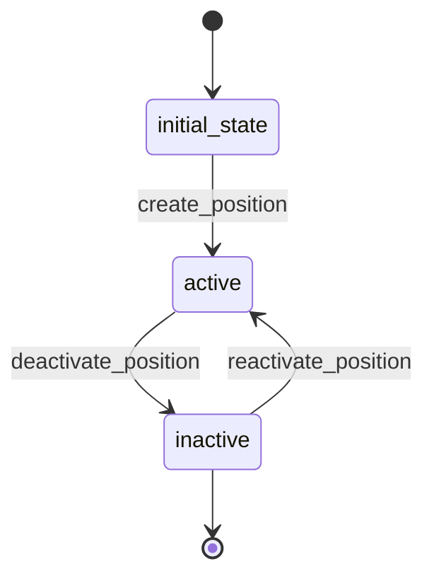

# Position Workflow

## States
- **initial_state**: Starting point
- **active**: Position is active and can be assigned
- **inactive**: Position is disabled

## Transitions

### initial_state → active
- **Name**: create_position
- **Type**: Automatic
- **Processor**: CreatePositionProcessor
- **Description**: Creates and activates position

### active → inactive
- **Name**: deactivate_position
- **Type**: Manual
- **Processor**: DeactivatePositionProcessor
- **Criteria**: ValidateNoActiveEmployees
- **Description**: Deactivates position

### inactive → active
- **Name**: reactivate_position
- **Type**: Manual
- **Processor**: ReactivatePositionProcessor
- **Description**: Reactivates position

## Processors

### CreatePositionProcessor
- **Purpose**: Initialize position with active status
- **Input**: Position entity data
- **Output**: Active position
- **Pseudocode**:
```
process(entity):
    entity.is_active = true
    entity.created_at = current_timestamp()
    validate_salary_range(entity.salary_range_min, entity.salary_range_max)
```

### DeactivatePositionProcessor
- **Purpose**: Disable position from assignment
- **Input**: Position entity
- **Output**: Inactive position
- **Pseudocode**:
```
process(entity):
    entity.is_active = false
    entity.deactivated_at = current_timestamp()
```

### ReactivatePositionProcessor
- **Purpose**: Reactivate position for assignment
- **Input**: Position entity
- **Output**: Active position
- **Pseudocode**:
```
process(entity):
    entity.is_active = true
    entity.reactivated_at = current_timestamp()
```

## Criteria

### ValidateNoActiveEmployees
- **Purpose**: Ensure no active employees assigned to position
- **Pseudocode**:
```
check(entity):
    active_employees = get_employees_by_position(entity.id, active_only=true)
    return len(active_employees) == 0
```

## Mermaid State Diagram

