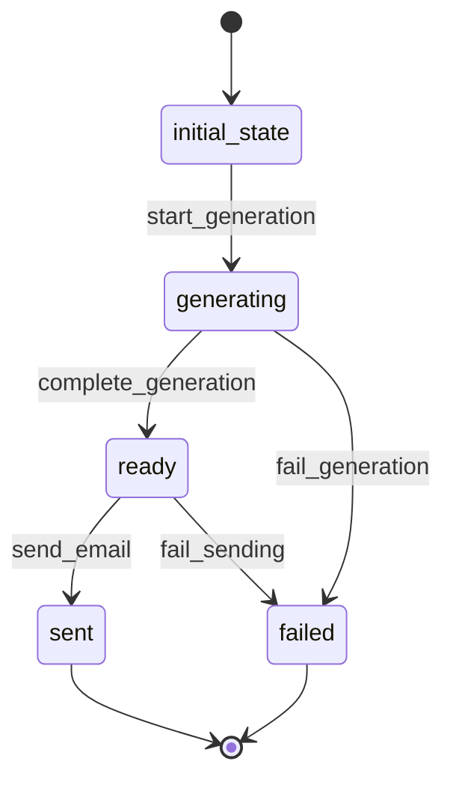

# Report Workflow

## Description
Workflow for generating and delivering email reports containing comment analysis summaries.

## States
- **initial_state**: Starting point
- **generating**: Report is being compiled
- **ready**: Report is ready for delivery
- **sent**: Report has been successfully sent via email
- **failed**: Report generation or sending failed

## Transitions

### initial_state → generating
- **Name**: start_generation
- **Type**: Automatic
- **Processor**: StartReportGenerationProcessor
- **Description**: Begin report compilation process

### generating → ready
- **Name**: complete_generation
- **Type**: Manual
- **Processor**: CompleteReportGenerationProcessor
- **Description**: Finalize report compilation

### ready → sent
- **Name**: send_email
- **Type**: Manual
- **Processor**: SendEmailProcessor
- **Description**: Send report via email

### generating → failed
- **Name**: fail_generation
- **Type**: Manual
- **Criterion**: ReportGenerationFailedCriterion
- **Description**: Mark report generation as failed

### ready → failed
- **Name**: fail_sending
- **Type**: Manual
- **Criterion**: EmailSendingFailedCriterion
- **Description**: Mark email sending as failed

## Mermaid State Diagram


## Processors

### StartReportGenerationProcessor
- **Entity**: Report
- **Input**: Report entity with period and recipient info
- **Purpose**: Begin compiling report data from analyses
- **Output**: Report entity with generation status
- **Pseudocode**:
```
process(entity):
    analyses = get_analyses_by_period(entity.report_period_start, entity.report_period_end)
    entity.total_comments = count(analyses)
    entity.avg_sentiment = calculate_average_sentiment(analyses)
    entity.top_keywords = extract_top_keywords(analyses)
    entity.toxicity_summary = calculate_toxicity_summary(analyses)
    entity.generation_started_at = current_timestamp()
    return entity
```

### CompleteReportGenerationProcessor
- **Entity**: Report
- **Input**: Report with compiled data
- **Purpose**: Finalize report and prepare for sending
- **Output**: Report ready for delivery
- **Pseudocode**:
```
process(entity):
    entity.summary_data = compile_final_summary(entity)
    entity.generated_at = current_timestamp()
    entity.status = "ready"
    return entity
```

### SendEmailProcessor
- **Entity**: Report
- **Input**: Ready report entity
- **Purpose**: Send report via email
- **Output**: Report with email delivery status
- **Pseudocode**:
```
process(entity):
    email_content = format_report_email(entity.summary_data)
    send_email(entity.recipient_email, entity.title, email_content)
    entity.email_sent_at = current_timestamp()
    entity.status = "sent"
    return entity
```

## Criteria

### ReportGenerationFailedCriterion
- **Purpose**: Check if report generation failed
- **Pseudocode**:
```
check(entity):
    return entity.summary_data is null or entity.generated_at is null
```

### EmailSendingFailedCriterion
- **Purpose**: Check if email sending failed
- **Pseudocode**:
```
check(entity):
    return entity.email_sent_at is null and entity.status != "sent"
```
