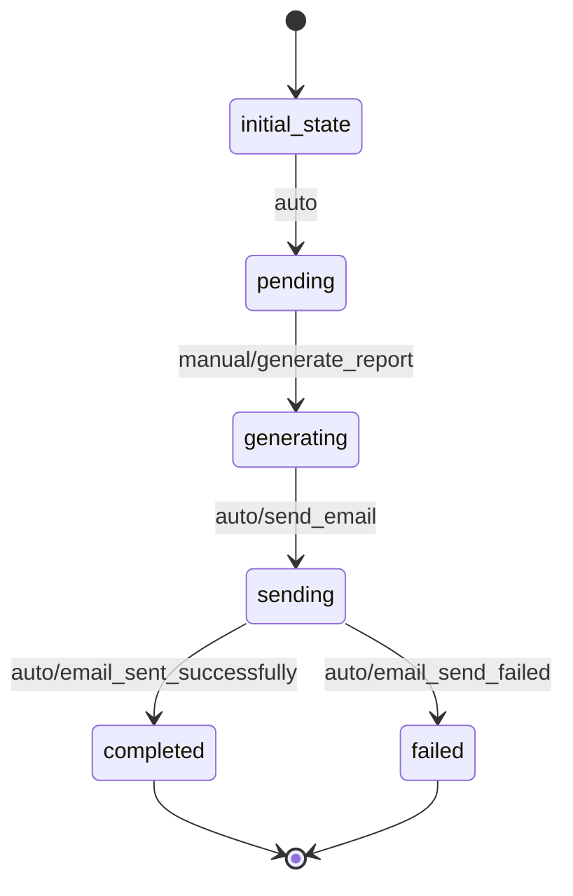

# Report Workflow

## States and Transitions

### States:
- **initial_state**: Starting point
- **pending**: Ready to generate report
- **generating**: Report generation in progress
- **sending**: Sending email to subscribers
- **completed**: Report sent successfully
- **failed**: Report sending failed

### Transitions:

1. **initial_state → pending**: Automatic transition to start workflow
2. **pending → generating**: Manual transition to start report generation
   - **Processor**: `generate_report` - Creates report content from analysis
3. **generating → sending**: Automatic transition when report is ready
   - **Processor**: `send_email` - Sends report to subscribers
4. **sending → completed**: Automatic transition when email sent successfully
   - **Criteria**: `email_sent_successfully` - Checks email delivery status
5. **sending → failed**: Automatic transition when email sending fails
   - **Criteria**: `email_send_failed` - Checks for email failures

## Processors

### generate_report
- **Entity**: Report
- **Input**: Analysis results, subscriber list
- **Purpose**: Generate formatted report content
- **Output**: Report content ready for email

**Pseudocode:**
```
process():
    analysis = get_analysis_by_id(entity.analysis_id)
    
    report_content = f"""
    London Houses Data Analysis Report
    
    Analysis Summary:
    - Total Properties: {analysis.results.total_records}
    - Average Price: £{analysis.metrics.avg_price:,.2f}
    - Most Expensive Neighborhood: {analysis.metrics.top_neighborhood}
    
    Key Insights:
    {format_insights(analysis.results)}
    
    Generated on: {current_timestamp()}
    """
    
    entity.report_content = report_content
```

### send_email
- **Entity**: Report
- **Input**: Report content, subscriber emails
- **Purpose**: Send email report to all subscribers
- **Output**: Delivery status update

**Pseudocode:**
```
process():
    try:
        for email in entity.subscribers:
            send_email_to(email, "London Houses Report", entity.report_content)
        
        entity.delivery_status = "sent"
        entity.sent_at = current_timestamp()
    except Exception:
        entity.delivery_status = "failed"
```

## Criteria

### email_sent_successfully
**Pseudocode:**
```
check():
    return entity.delivery_status == "sent"
```

### email_send_failed
**Pseudocode:**
```
check():
    return entity.delivery_status == "failed"
```

## Workflow Diagram


```mermaid
stateDiagram-v2
    [*] --> initial_state
    initial_state --> pending : auto
    pending --> generating : manual/generate_report
    generating --> sending : auto/send_email
    sending --> completed : auto/email_sent_successfully
    sending --> failed : auto/email_send_failed
    completed --> [*]
    failed --> [*]
```
