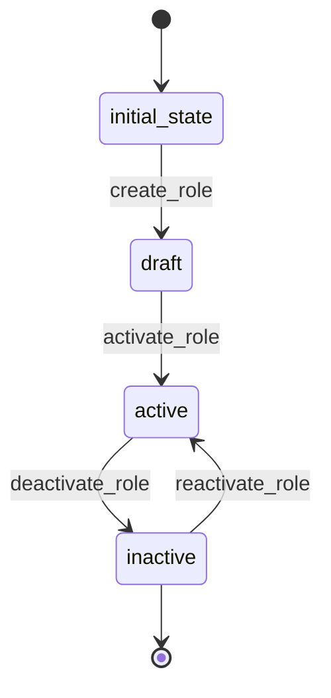

# Role Workflow

## States
- **initial_state**: Starting point
- **draft**: Role created but not finalized
- **active**: Role is active and can be assigned
- **inactive**: Role is disabled

## Transitions

### initial_state → draft
- **Name**: create_role
- **Type**: Automatic
- **Processor**: CreateRoleProcessor
- **Description**: Creates new role

### draft → active
- **Name**: activate_role
- **Type**: Manual
- **Processor**: ActivateRoleProcessor
- **Criteria**: ValidateRolePermissions
- **Description**: Activates role for assignment

### active → inactive
- **Name**: deactivate_role
- **Type**: Manual
- **Processor**: DeactivateRoleProcessor
- **Description**: Deactivates role

### inactive → active
- **Name**: reactivate_role
- **Type**: Manual
- **Processor**: ReactivateRoleProcessor
- **Description**: Reactivates role

## Processors

### CreateRoleProcessor
- **Purpose**: Initialize role with basic settings
- **Input**: Role entity data
- **Output**: Role in draft state
- **Pseudocode**:
```
process(entity):
    entity.is_active = false
    entity.created_at = current_timestamp()
    entity.permission_ids = []
```

### ActivateRoleProcessor
- **Purpose**: Activate role for user assignment
- **Input**: Role entity
- **Output**: Active role
- **Pseudocode**:
```
process(entity):
    entity.is_active = true
    entity.activated_at = current_timestamp()
```

### DeactivateRoleProcessor
- **Purpose**: Disable role from assignment
- **Input**: Role entity
- **Output**: Inactive role
- **Pseudocode**:
```
process(entity):
    entity.is_active = false
    entity.deactivated_at = current_timestamp()
```

## Criteria

### ValidateRolePermissions
- **Purpose**: Ensure role has valid permissions
- **Pseudocode**:
```
check(entity):
    return len(entity.permission_ids) > 0 and all_permissions_exist(entity.permission_ids)
```

## Mermaid State Diagram

