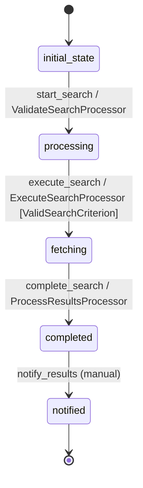

# Search Workflow

## Description
Manages user search requests, coordinates pet data retrieval, and handles result notifications.

## States
- **initial_state**: Starting point for new search requests
- **processing**: Search parameters being processed and validated
- **fetching**: Retrieving pet data based on search criteria
- **completed**: Search completed with results available
- **notified**: User notified of search results or empty results

## Transitions

### initial_state → processing
- **Name**: start_search
- **Type**: Automatic
- **Processor**: ValidateSearchProcessor
- **Description**: Validate and prepare search parameters

### processing → fetching
- **Name**: execute_search
- **Type**: Automatic
- **Processor**: ExecuteSearchProcessor
- **Criterion**: ValidSearchCriterion
- **Description**: Execute search if parameters are valid

### fetching → completed
- **Name**: complete_search
- **Type**: Automatic
- **Processor**: ProcessResultsProcessor
- **Description**: Process search results and update counters

### completed → notified
- **Name**: notify_results
- **Type**: Manual
- **Description**: Send notification to user about search results

## Processors

### ValidateSearchProcessor
- **Entity**: Search
- **Input**: Raw search parameters from user
- **Purpose**: Validate and sanitize search parameters
- **Output**: Validated search parameters
- **Pseudocode**:
```
process():
    entity.species = sanitize_species(entity.species)
    entity.status = validate_status(entity.status)
    entity.categoryId = validate_category_id(entity.categoryId)
    entity.searchTimestamp = current_timestamp()
    entity.validation_complete = true
```

### ExecuteSearchProcessor
- **Entity**: Search
- **Input**: Validated search parameters
- **Purpose**: Coordinate pet data retrieval from external API
- **Output**: Search results and pet entity creation triggers
- **Pseudocode**:
```
process():
    search_params = build_api_parameters(entity)
    pet_results = call_petstore_api(search_params)
    entity.resultCount = len(pet_results)
    entity.hasResults = entity.resultCount > 0
    
    for pet_data in pet_results:
        trigger_pet_entity_creation(pet_data, entity.id)
```

### ProcessResultsProcessor
- **Entity**: Search
- **Input**: Search execution results
- **Purpose**: Finalize search results and prepare notifications
- **Output**: Completed search with notification readiness
- **Pseudocode**:
```
process():
    entity.completion_timestamp = current_timestamp()
    entity.search_duration = entity.completion_timestamp - entity.searchTimestamp
    
    if not entity.hasResults:
        entity.notification_message = "No pets match your search criteria"
    else:
        entity.notification_message = f"Found {entity.resultCount} pets matching your criteria"
```

## Criteria

### ValidSearchCriterion
- **Purpose**: Ensure search parameters are valid before execution
- **Pseudocode**:
```
check():
    return entity.validation_complete == true and 
           (entity.species or entity.status or entity.categoryId)
```

## Mermaid State Diagram

