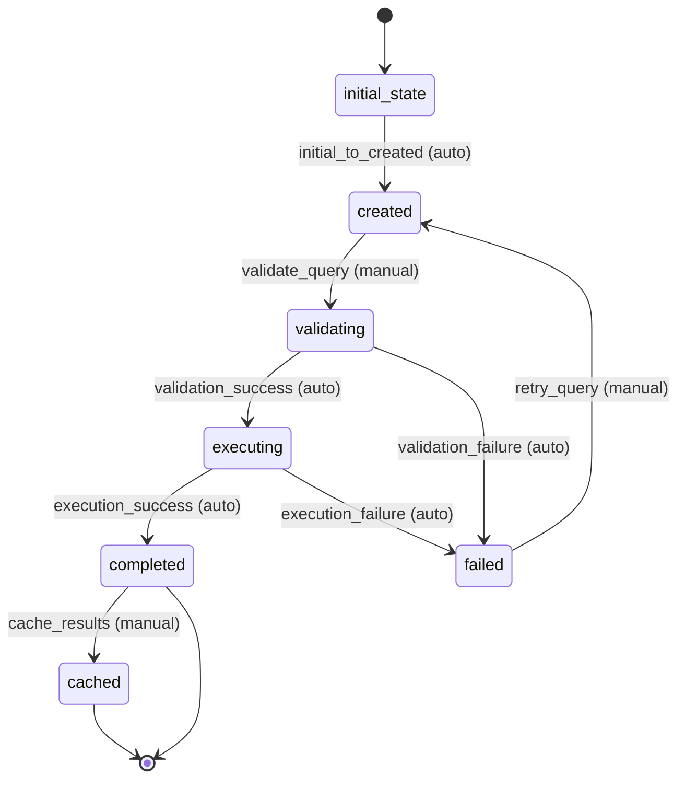

# Search Query Workflow

## Overview
The Search Query workflow manages the execution of search operations for Hacker News items with support for complex queries, filtering, and parent hierarchy joins. It handles query validation, execution, result processing, and caching.

## Workflow States

### 1. initial_state
- **Description**: Starting state for all new search queries
- **Entry Condition**: Query is created
- **Exit Condition**: Automatic transition to created state

### 2. created
- **Description**: Query has been created but not validated
- **Entry Condition**: Query metadata is initialized
- **Exit Condition**: Query is ready for validation

### 3. validating
- **Description**: Query syntax and parameters are being validated
- **Entry Condition**: Validation process starts
- **Exit Condition**: Validation completes successfully or fails

### 4. executing
- **Description**: Query is being executed against the database
- **Entry Condition**: Query is validated and execution starts
- **Exit Condition**: Execution completes successfully or fails

### 5. completed
- **Description**: Query execution completed successfully
- **Entry Condition**: Results are available
- **Exit Condition**: Results may be cached

### 6. cached
- **Description**: Query results are cached and available
- **Entry Condition**: Results are stored in cache
- **Exit Condition**: Cache may expire

### 7. failed
- **Description**: Query execution failed
- **Entry Condition**: Validation or execution failed
- **Exit Condition**: Manual intervention or retry

## Workflow Transitions

### 1. initial_to_created
- **From**: initial_state
- **To**: created
- **Type**: Automatic
- **Trigger**: Query creation
- **Processors**: None
- **Criteria**: None

### 2. validate_query
- **From**: created
- **To**: validating
- **Type**: Manual
- **Trigger**: Validation request
- **Processors**: validate_query_processor
- **Criteria**: None

### 3. validation_success
- **From**: validating
- **To**: executing
- **Type**: Automatic
- **Trigger**: Validation success
- **Processors**: prepare_execution_processor
- **Criteria**: validation_success_criterion

### 4. validation_failure
- **From**: validating
- **To**: failed
- **Type**: Automatic
- **Trigger**: Validation failure
- **Processors**: handle_validation_failure_processor
- **Criteria**: validation_failure_criterion

### 5. execution_success
- **From**: executing
- **To**: completed
- **Type**: Automatic
- **Trigger**: Execution success
- **Processors**: process_results_processor
- **Criteria**: execution_success_criterion

### 6. execution_failure
- **From**: executing
- **To**: failed
- **Type**: Automatic
- **Trigger**: Execution failure
- **Processors**: handle_execution_failure_processor
- **Criteria**: execution_failure_criterion

### 7. cache_results
- **From**: completed
- **To**: cached
- **Type**: Manual
- **Trigger**: Cache request
- **Processors**: cache_results_processor
- **Criteria**: cache_eligible_criterion

### 8. retry_query
- **From**: failed
- **To**: created
- **Type**: Manual
- **Trigger**: Retry request
- **Processors**: reset_query_processor
- **Criteria**: retry_allowed_criterion

## Workflow Diagram



## Processors

### 1. validate_query_processor
- **Entity**: SearchQuery
- **Purpose**: Validate query syntax, parameters, and constraints
- **Input**: Search query entity
- **Output**: Entity with validation results
- **Pseudocode**:
```
process(entity):
    validation_errors = []
    
    // Validate query text
    if not entity.query_text or entity.query_text.strip() == "":
        validation_errors.append("Query text is required")
    
    // Validate query type
    valid_types = ["text", "field", "complex", "hierarchy"]
    if entity.query_type not in valid_types:
        validation_errors.append(f"Invalid query type: {entity.query_type}")
    
    // Validate filters
    if entity.filters:
        filter_errors = validate_filter_structure(entity.filters)
        validation_errors.extend(filter_errors)
    
    // Validate search fields
    if entity.search_fields:
        valid_fields = get_valid_search_fields()
        invalid_fields = [f for f in entity.search_fields if f not in valid_fields]
        if invalid_fields:
            validation_errors.append(f"Invalid search fields: {invalid_fields}")
    
    // Validate result limits
    if entity.max_results and entity.max_results > MAX_SEARCH_RESULTS:
        validation_errors.append(f"Max results exceeds limit: {MAX_SEARCH_RESULTS}")
    
    // Validate date ranges
    if entity.date_range:
        if entity.date_range.get("start") > entity.date_range.get("end"):
            validation_errors.append("Invalid date range: start > end")
    
    entity.validation_errors = validation_errors
    entity.validation_status = "passed" if not validation_errors else "failed"
    entity.validated_at = current_timestamp()
    
    return entity
```

### 2. prepare_execution_processor
- **Entity**: SearchQuery
- **Purpose**: Prepare query for execution
- **Input**: Validated query entity
- **Output**: Entity ready for execution
- **Pseudocode**:
```
process(entity):
    // Generate optimized query plan
    entity.query_plan = generate_query_plan(entity)
    
    // Set execution parameters
    entity.execution_params = {
        "timeout": calculate_timeout(entity),
        "max_results": entity.max_results or DEFAULT_MAX_RESULTS,
        "include_hierarchy": entity.include_hierarchy or false,
        "cache_key": generate_cache_key(entity)
    }
    
    // Check for cached results
    cached_result = check_cache(entity.execution_params.cache_key)
    if cached_result and not is_cache_expired(cached_result):
        entity.cached_result_available = true
        entity.cache_key = entity.execution_params.cache_key
    
    entity.prepared_at = current_timestamp()
    
    return entity
```

### 3. handle_validation_failure_processor
- **Entity**: SearchQuery
- **Purpose**: Handle validation failures
- **Input**: Entity with validation errors
- **Output**: Entity with failure handling
- **Pseudocode**:
```
process(entity):
    entity.failure_reason = "validation_failed"
    entity.failure_details = entity.validation_errors
    entity.failed_at = current_timestamp()
    
    log_warning(f"Search query {entity.query_id} validation failed", entity.validation_errors)
    
    return entity
```

### 4. process_results_processor
- **Entity**: SearchQuery
- **Purpose**: Process search results and create collection
- **Input**: Entity with execution results
- **Output**: Entity with processed results
- **Pseudocode**:
```
process(entity):
    // Create collection for results
    collection_id = create_search_result_collection(entity)
    entity.result_collection_id = collection_id
    
    // Process hierarchy if requested
    if entity.include_hierarchy:
        entity.search_results = include_parent_hierarchy(entity.search_results)
    
    // Apply post-processing filters
    entity.search_results = apply_post_filters(entity.search_results, entity.filters)
    
    // Generate result statistics
    entity.result_stats = {
        "total_results": len(entity.search_results),
        "execution_time_ms": entity.execution_time,
        "hierarchy_included": entity.include_hierarchy,
        "cache_hit": entity.cached_result_available or false
    }
    
    entity.completed_at = current_timestamp()
    
    return entity
```

### 5. handle_execution_failure_processor
- **Entity**: SearchQuery
- **Purpose**: Handle execution failures
- **Input**: Entity with execution failure
- **Output**: Entity with failure handling
- **Pseudocode**:
```
process(entity):
    entity.failure_reason = "execution_failed"
    entity.failure_details = entity.execution_error
    entity.failed_at = current_timestamp()
    
    // Log execution failure
    log_error(f"Search query {entity.query_id} execution failed", {
        "query_text": entity.query_text,
        "error": entity.execution_error,
        "execution_time": entity.execution_time
    })
    
    return entity
```

### 6. cache_results_processor
- **Entity**: SearchQuery
- **Purpose**: Cache search results for future use
- **Input**: Completed query entity
- **Output**: Entity with cached results
- **Pseudocode**:
```
process(entity):
    // Calculate cache expiration
    cache_ttl = calculate_cache_ttl(entity)
    entity.cache_expires_at = current_timestamp() + cache_ttl
    
    // Store results in cache
    cache_data = {
        "results": entity.search_results,
        "result_stats": entity.result_stats,
        "collection_id": entity.result_collection_id,
        "created_at": current_timestamp(),
        "expires_at": entity.cache_expires_at
    }
    
    store_in_cache(entity.cache_key, cache_data)
    
    entity.cached_at = current_timestamp()
    
    return entity
```

### 7. reset_query_processor
- **Entity**: SearchQuery
- **Purpose**: Reset query for retry
- **Input**: Failed query entity
- **Output**: Reset query entity
- **Pseudocode**:
```
process(entity):
    // Clear failure information
    entity.validation_errors = []
    entity.execution_error = None
    entity.failure_reason = None
    entity.failure_details = None
    
    // Reset status
    entity.validation_status = None
    entity.execution_status = None
    
    // Clear results
    entity.search_results = []
    entity.result_collection_id = None
    entity.result_stats = None
    
    // Update retry information
    entity.retry_count = entity.retry_count + 1 if entity.retry_count else 1
    entity.reset_at = current_timestamp()
    
    return entity
```

## Criteria

### 1. validation_success_criterion
- **Purpose**: Check if validation was successful
- **Pseudocode**:
```
check(entity):
    return (entity.validation_status == "passed" and 
            not entity.validation_errors)
```

### 2. validation_failure_criterion
- **Purpose**: Check if validation failed
- **Pseudocode**:
```
check(entity):
    return (entity.validation_status == "failed" or 
            entity.validation_errors)
```

### 3. execution_success_criterion
- **Purpose**: Check if execution was successful
- **Pseudocode**:
```
check(entity):
    return (entity.execution_status == "completed" and 
            entity.result_count >= 0 and
            not entity.execution_error)
```

### 4. execution_failure_criterion
- **Purpose**: Check if execution failed
- **Pseudocode**:
```
check(entity):
    return (entity.execution_status == "failed" or 
            entity.execution_error)
```

### 5. cache_eligible_criterion
- **Purpose**: Check if results are eligible for caching
- **Pseudocode**:
```
check(entity):
    return (entity.result_count > 0 and 
            entity.execution_time < CACHE_THRESHOLD_MS and
            not entity.cached_result_available)
```

### 6. retry_allowed_criterion
- **Purpose**: Check if retry is allowed
- **Pseudocode**:
```
check(entity):
    max_retries = 3
    retry_count = entity.retry_count or 0
    return (retry_count < max_retries and 
            entity.failure_reason in ["validation_failed", "execution_failed"])
```
