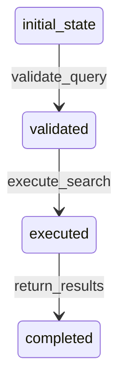

# SearchQuery Workflow

## States
- **initial_state**: Starting state
- **validated**: Query validated and parsed
- **executed**: Query executed against database
- **completed**: Results returned successfully

## Transitions

### initial_state → validated
- **Name**: validate_query
- **Type**: Automatic
- **Processor**: parse_and_validate_query
- **Purpose**: Parse and validate search query syntax

### validated → executed
- **Name**: execute_search
- **Type**: Manual
- **Processor**: perform_search
- **Purpose**: Execute search against HNItem database

### executed → completed
- **Name**: return_results
- **Type**: Automatic
- **Processor**: format_search_results
- **Purpose**: Format and return search results

## Processors

### parse_and_validate_query
- **Entity**: SearchQuery
- **Input**: Raw search query
- **Purpose**: Parse query syntax and validate parameters
- **Output**: Validated query with parsed filters
- **Pseudocode**:
```
process(entity):
    if not entity.query_text and not entity.filters:
        entity.validation_error = "Query text or filters required"
        return
    
    entity.parsed_filters = parse_filters(entity.filters)
    entity.search_terms = tokenize_query_text(entity.query_text)
    entity.validation_status = "valid"
```

### perform_search
- **Entity**: SearchQuery
- **Input**: Validated query
- **Purpose**: Execute search with hierarchy joins
- **Output**: Query with results
- **Pseudocode**:
```
process(entity):
    start_time = current_timestamp()
    
    base_results = search_hnitem_index(entity.search_terms, entity.parsed_filters)
    
    if entity.include_hierarchy:
        entity.results = expand_with_hierarchy(base_results)
    else:
        entity.results = base_results
    
    entity.result_count = len(entity.results)
    entity.execution_time_ms = current_timestamp() - start_time
    entity.executed_at = current_timestamp()
```

### format_search_results
- **Entity**: SearchQuery
- **Input**: Query with raw results
- **Purpose**: Format results for API response
- **Output**: Query with formatted results
- **Pseudocode**:
```
process(entity):
    entity.formatted_results = []
    for result in entity.results:
        formatted_item = format_hnitem_for_response(result)
        if entity.include_hierarchy:
            formatted_item.parent_chain = get_parent_chain(result)
        entity.formatted_results.append(formatted_item)
```

## Workflow Diagram


```mermaid
stateDiagram-v2
    initial_state --> validated: validate_query
    validated --> executed: execute_search
    executed --> completed: return_results
```
