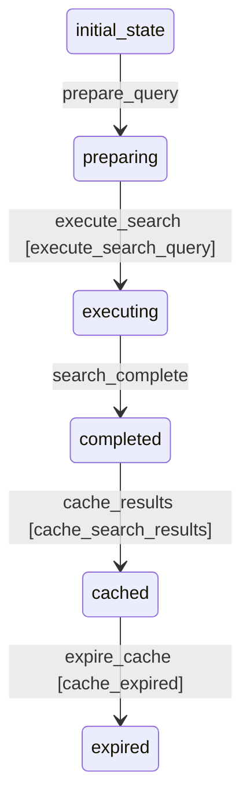

# SearchQuery Workflow Requirements

## Workflow States
1. **initial_state**: Starting point for new search queries
2. **preparing**: Query being prepared and validated
3. **executing**: Search query being executed
4. **completed**: Search completed successfully
5. **cached**: Results cached for future use
6. **expired**: Cached results expired

## Transitions
- **prepare_query**: initial_state → preparing (automatic)
- **execute_search**: preparing → executing (manual, with processor)
- **search_complete**: executing → completed (automatic)
- **cache_results**: completed → cached (manual, with processor)
- **expire_cache**: cached → expired (automatic, with criteria)

## Processors
1. **execute_search_query**: Executes the search against HN items
2. **cache_search_results**: Caches search results for performance

## Criteria
1. **cache_expired**: Checks if cached results have expired

## Workflow Diagram

```mermaid
stateDiagram-v2
    initial_state --> preparing : prepare_query
    preparing --> executing : execute_search [execute_search_query]
    executing --> completed : search_complete
    completed --> cached : cache_results [cache_search_results]
    cached --> expired : expire_cache [cache_expired]
```

## Processor Details

### execute_search_query
- **Purpose**: Execute search query against HN items database
- **Input**: SearchQuery entity with query parameters
- **Process**: Parse query, apply filters, search indices, rank results
- **Output**: Search results with relevance scores and metadata

### cache_search_results
- **Purpose**: Cache search results for improved performance
- **Input**: Completed search with results
- **Process**: Store results in cache with TTL, create cache keys
- **Output**: Cached search results with expiration metadata

## Criteria Details

### cache_expired
- **Purpose**: Check if cached search results have expired
- **Check**: Current time > cached_at + cache_ttl (24 hours)
- **Returns**: Boolean indicating if cache has expired
