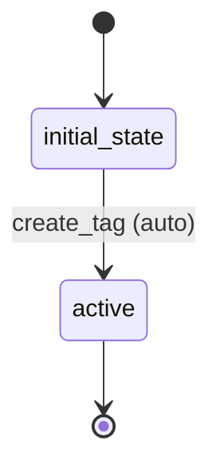

# Tag Workflow

## Workflow States and Transitions

### States:
- `initial_state`: Starting state
- `active`: Tag is active and available

### Transitions:



### Workflow Rules:
- Simple workflow with automatic transition to active state
- No manual transitions needed for basic reference entity

## Processors

### CreateTagProcessor
- **Entity**: Tag
- **Purpose**: Initialize tag data
- **Input**: Tag entity with name
- **Output**: Tag entity ready for use
- **Pseudocode**:
```
process(entity):
    validate_tag_name(entity.name)
    entity.createdAt = current_timestamp()
    return entity
```

## Criteria

### TagValidityCriterion
- **Purpose**: Check if tag data is valid
- **Pseudocode**:
```
check(entity):
    return entity.name != null and entity.name.length > 0
```
