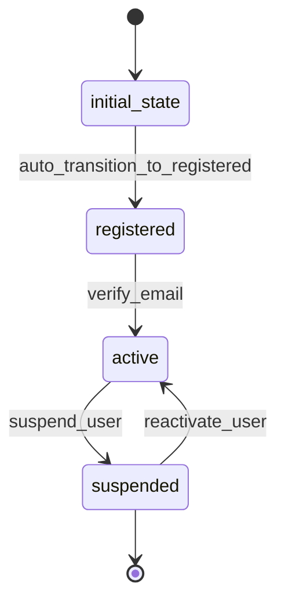

# User Workflow

## Workflow States



## State Transitions

### 1. initial_state → registered
- **Transition**: auto_transition_to_registered
- **Type**: Automatic
- **Processor**: RegisterUserProcessor
- **Purpose**: Register new user account

### 2. registered → active
- **Transition**: verify_email
- **Type**: Manual
- **Processor**: ActivateUserProcessor
- **Purpose**: Activate user account after email verification

### 3. active → suspended
- **Transition**: suspend_user
- **Type**: Manual
- **Purpose**: Suspend user account for violations

### 4. suspended → active
- **Transition**: reactivate_user
- **Type**: Manual
- **Purpose**: Reactivate suspended user account

## Processors

### RegisterUserProcessor
- **Entity**: User
- **Input**: User registration data
- **Purpose**: Create new user account and send verification email
- **Output**: Registered user awaiting verification
- **Pseudocode**:
```
process(entity):
    validate_unique_username(entity.username)
    validate_unique_email(entity.email)
    entity.password = encrypt_password(entity.password)
    entity.registeredAt = current_timestamp()
    entity.emailVerificationToken = generate_token()
    send_verification_email(entity.email, entity.emailVerificationToken)
```

### ActivateUserProcessor
- **Entity**: User
- **Input**: User entity with verification token
- **Purpose**: Activate user account after email verification
- **Output**: Active user account
- **Pseudocode**:
```
process(entity):
    entity.emailVerified = true
    entity.activatedAt = current_timestamp()
    entity.emailVerificationToken = null
    send_welcome_email(entity.email)
```

## Criteria

### ValidUserCriterion
- **Purpose**: Validate user data before registration
- **Pseudocode**:
```
check(entity):
    return entity.username != null AND
           entity.email != null AND
           entity.password != null AND
           is_valid_email(entity.email)
```
