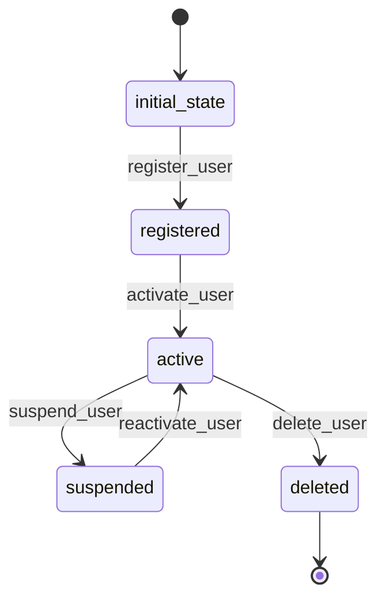

# User Workflow

## States
- **initial_state**: Starting point
- **registered**: User account created
- **active**: User account is active and can receive notifications
- **suspended**: User account temporarily disabled
- **deleted**: User account permanently removed

## Transitions

### initial_state → registered
- **Name**: register_user
- **Type**: Automatic
- **Processor**: RegisterUserProcessor
- **Description**: Creates new user account

### registered → active
- **Name**: activate_user
- **Type**: Manual
- **Processor**: ActivateUserProcessor
- **Description**: Activates user account for notifications

### active → suspended
- **Name**: suspend_user
- **Type**: Manual
- **Processor**: SuspendUserProcessor
- **Description**: Temporarily disables user account

### suspended → active
- **Name**: reactivate_user
- **Type**: Manual
- **Processor**: ReactivateUserProcessor
- **Description**: Reactivates suspended user account

### active → deleted
- **Name**: delete_user
- **Type**: Manual
- **Processor**: DeleteUserProcessor
- **Description**: Permanently removes user account

## Mermaid State Diagram


## Processors

### RegisterUserProcessor
- **Entity**: User
- **Input**: User registration data (email, name, timezone, notification_time)
- **Purpose**: Create new user account with default settings
- **Output**: User entity with registered state
- **Pseudocode**:
```
process(entity):
    validate_email(entity.email)
    set_default_values(entity)
    entity.meta.state = "registered"
    return entity
```

### ActivateUserProcessor
- **Entity**: User
- **Input**: User entity
- **Purpose**: Activate user account for receiving notifications
- **Output**: User entity with active state
- **Pseudocode**:
```
process(entity):
    entity.active = true
    entity.meta.state = "active"
    return entity
```

### SuspendUserProcessor
- **Entity**: User
- **Input**: User entity
- **Purpose**: Temporarily disable user account
- **Output**: User entity with suspended state
- **Pseudocode**:
```
process(entity):
    entity.active = false
    entity.meta.state = "suspended"
    return entity
```

### ReactivateUserProcessor
- **Entity**: User
- **Input**: User entity
- **Purpose**: Reactivate suspended user account
- **Output**: User entity with active state
- **Pseudocode**:
```
process(entity):
    entity.active = true
    entity.meta.state = "active"
    return entity
```

### DeleteUserProcessor
- **Entity**: User
- **Input**: User entity
- **Purpose**: Permanently remove user account and related data
- **Output**: User entity with deleted state
- **Pseudocode**:
```
process(entity):
    deactivate_all_subscriptions(entity.id)
    entity.active = false
    entity.meta.state = "deleted"
    return entity
```
