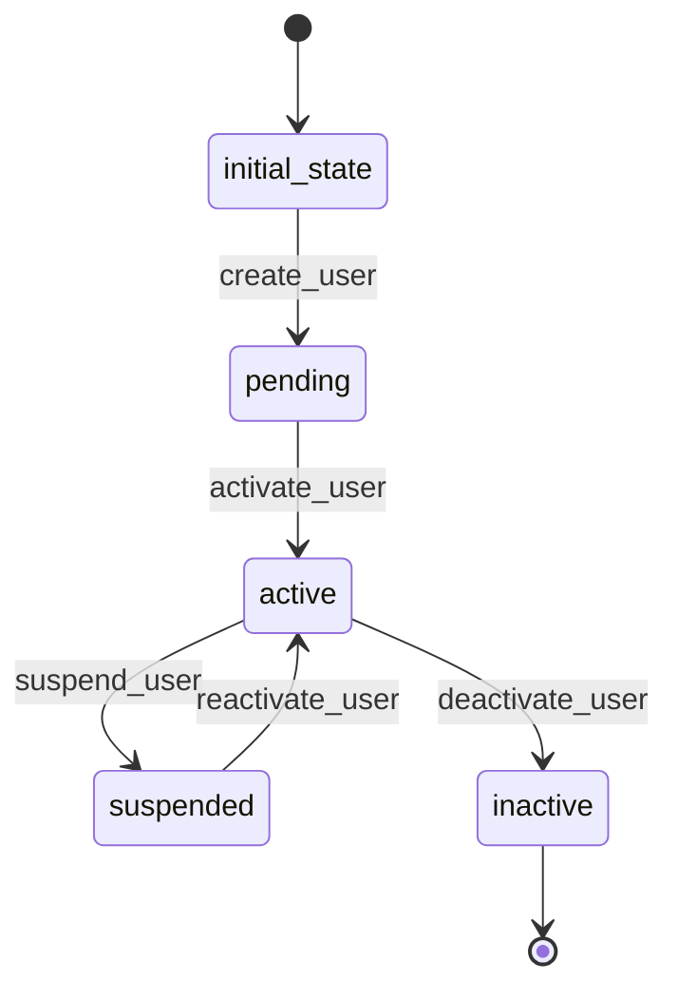

# User Workflow

## States
- **initial_state**: Starting point
- **pending**: User account created but not activated
- **active**: User account is active and can login
- **suspended**: User account temporarily disabled
- **inactive**: User account permanently disabled

## Transitions

### initial_state → pending
- **Name**: create_user
- **Type**: Automatic
- **Processor**: CreateUserProcessor
- **Description**: Creates new user account

### pending → active
- **Name**: activate_user
- **Type**: Manual
- **Processor**: ActivateUserProcessor
- **Description**: Activates user account

### active → suspended
- **Name**: suspend_user
- **Type**: Manual
- **Processor**: SuspendUserProcessor
- **Description**: Temporarily suspends user account

### suspended → active
- **Name**: reactivate_user
- **Type**: Manual
- **Processor**: ReactivateUserProcessor
- **Description**: Reactivates suspended user account

### active → inactive
- **Name**: deactivate_user
- **Type**: Manual
- **Processor**: DeactivateUserProcessor
- **Description**: Permanently deactivates user account

## Processors

### CreateUserProcessor
- **Purpose**: Initialize user account with default settings
- **Input**: User entity data
- **Output**: User with pending status
- **Pseudocode**:
```
process(entity):
    entity.is_active = false
    entity.created_at = current_timestamp()
    entity.password_hash = hash_password(entity.password)
    send_activation_email(entity.email)
```

### ActivateUserProcessor
- **Purpose**: Activate user account for login
- **Input**: User entity
- **Output**: Active user
- **Pseudocode**:
```
process(entity):
    entity.is_active = true
    entity.activated_at = current_timestamp()
    send_welcome_email(entity.email)
```

### SuspendUserProcessor
- **Purpose**: Temporarily disable user access
- **Input**: User entity
- **Output**: Suspended user
- **Pseudocode**:
```
process(entity):
    entity.is_active = false
    entity.suspended_at = current_timestamp()
    revoke_active_sessions(entity.id)
```

## Mermaid State Diagram

