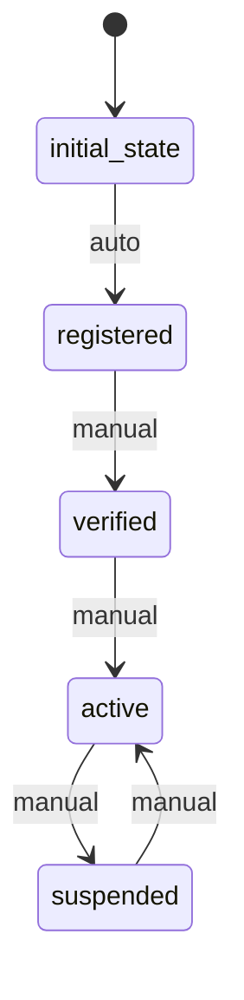

# User Workflow

## States
- **initial_state**: Starting state
- **registered**: User has registered
- **verified**: User identity verified
- **active**: User can place orders
- **suspended**: User account suspended

## Transitions
- **initial_state → registered**: Automatic transition when user signs up
- **registered → verified**: Manual transition after identity verification
- **verified → active**: Manual transition after approval
- **active → suspended**: Manual transition for policy violations
- **suspended → active**: Manual transition after review

## Processors

### ValidateUserInfo
- **Entity**: User
- **Input**: User registration data
- **Purpose**: Validate user information and contact details
- **Output**: User with validation status
- **Pseudocode**:
```
process():
  validate email format
  check phone number format
  verify required fields
  set registration timestamp
  return updated entity
```

### SendWelcomeEmail
- **Entity**: User
- **Input**: Verified user data
- **Purpose**: Send welcome email to new users
- **Output**: User with email sent flag
- **Pseudocode**:
```
process():
  compose welcome email
  send email to user.email
  log email sent
  set welcomeEmailSent = true
  return updated entity
```

## Criteria

### IsValidEmail
- **Purpose**: Check if user has valid email format
- **Pseudocode**:
```
check():
  return entity.email matches email regex pattern
```

## Workflow Diagram

