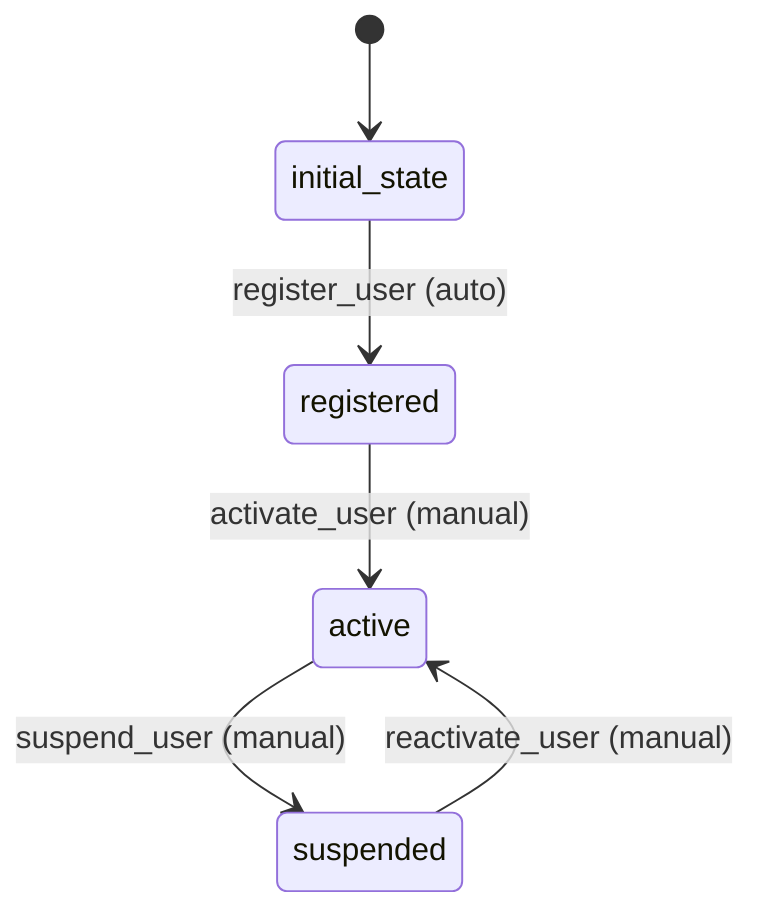

# User Workflow

## Workflow States and Transitions

### States:
- `initial_state`: Starting state
- `registered`: User has been registered
- `active`: User account is active
- `suspended`: User account is suspended

### Transitions:



### Workflow Rules:
- Initial transition from `initial_state` to `registered` is automatic
- All other transitions are manual
- Loop transitions (active ↔ suspended) are manual

## Processors

### RegisterUserProcessor
- **Entity**: User
- **Purpose**: Register new user with validation
- **Input**: User entity with basic information
- **Output**: User entity with registered status
- **Pseudocode**:
```
process(entity):
    validate_username_unique(entity.username)
    validate_email_format(entity.email)
    encrypt_password(entity.password)
    entity.userStatus = 0  // registered
    entity.registeredAt = current_timestamp()
    return entity
```

### ActivateUserProcessor
- **Entity**: User
- **Purpose**: Activate user account for full access
- **Input**: User entity in registered state
- **Output**: User entity with active status
- **Pseudocode**:
```
process(entity):
    if entity.userStatus != 0:
        throw error("User not in registered state")
    entity.userStatus = 1  // active
    entity.activatedAt = current_timestamp()
    return entity
```

## Criteria

### UserValidityCriterion
- **Purpose**: Check if user data is valid
- **Pseudocode**:
```
check(entity):
    return entity.username != null and entity.email != null
```
