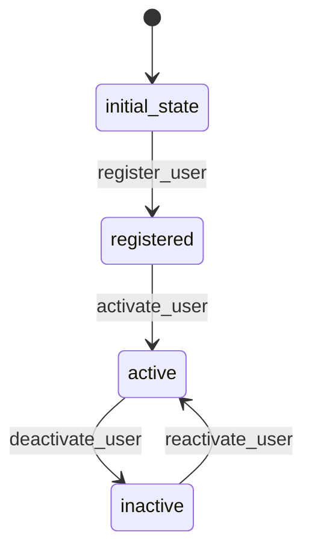

# User Workflow

## Description
Manages the lifecycle of user accounts in the Purrfect Pets store.

## States
- **initial_state**: Starting point
- **registered**: User has registered but not verified
- **active**: User account is active and verified
- **inactive**: User account is deactivated

## Transitions

### initial_state → registered
- **Name**: register_user
- **Type**: Automatic
- **Processor**: RegisterUserProcessor

### registered → active
- **Name**: activate_user
- **Type**: Manual
- **Processor**: ActivateUserProcessor

### active → inactive
- **Name**: deactivate_user
- **Type**: Manual
- **Processor**: DeactivateUserProcessor

### inactive → active
- **Name**: reactivate_user
- **Type**: Manual
- **Processor**: ReactivateUserProcessor

## Processors

### RegisterUserProcessor
- **Entity**: User
- **Input**: User data
- **Purpose**: Initialize user registration
- **Output**: User with registered status
- **Pseudocode**:
```
process(entity):
    entity.registration_date = current_timestamp()
    entity.last_login = null
    entity.verification_token = generate_token()
    return entity
```

### ActivateUserProcessor
- **Entity**: User
- **Input**: User entity
- **Purpose**: Activate user account
- **Output**: User with active status
- **Pseudocode**:
```
process(entity):
    entity.activation_date = current_timestamp()
    entity.verification_token = null
    entity.last_updated = current_timestamp()
    return entity
```

### DeactivateUserProcessor
- **Entity**: User
- **Input**: User entity
- **Purpose**: Deactivate user account
- **Output**: User with inactive status
- **Pseudocode**:
```
process(entity):
    entity.deactivation_date = current_timestamp()
    entity.last_updated = current_timestamp()
    return entity
```

### ReactivateUserProcessor
- **Entity**: User
- **Input**: User entity
- **Purpose**: Reactivate user account
- **Output**: User with active status
- **Pseudocode**:
```
process(entity):
    entity.reactivation_date = current_timestamp()
    entity.deactivation_date = null
    entity.last_updated = current_timestamp()
    return entity
```

## Mermaid State Diagram

```mermaid
stateDiagram-v2
    [*] --> initial_state
    initial_state --> registered : register_user
    registered --> active : activate_user
    active --> inactive : deactivate_user
    inactive --> active : reactivate_user
```
