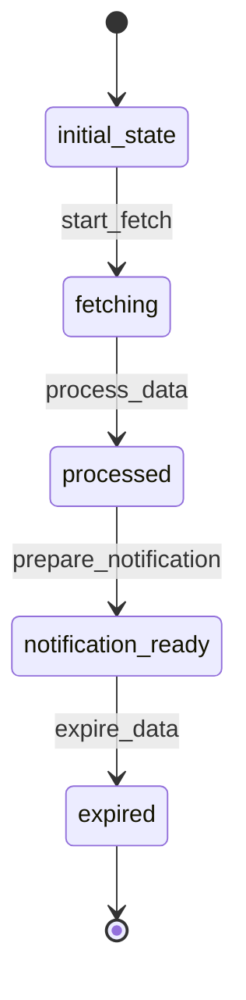

# WeatherData Workflow

## States
- **initial_state**: Starting point
- **fetching**: Data being retrieved from MSC GeoMet API
- **processed**: Data successfully fetched and validated
- **notification_ready**: Data ready for email notification
- **expired**: Data is outdated and needs refresh

## Transitions

### initial_state → fetching
- **Name**: start_fetch
- **Type**: Automatic
- **Processor**: StartFetchProcessor
- **Description**: Initiates weather data fetch from API

### fetching → processed
- **Name**: process_data
- **Type**: Manual
- **Processor**: ProcessWeatherDataProcessor
- **Criteria**: ValidWeatherDataCriteria
- **Description**: Processes and validates fetched weather data

### processed → notification_ready
- **Name**: prepare_notification
- **Type**: Manual
- **Processor**: PrepareNotificationProcessor
- **Description**: Prepares weather data for email notification

### notification_ready → expired
- **Name**: expire_data
- **Type**: Manual
- **Processor**: ExpireDataProcessor
- **Description**: Marks data as expired after 24 hours

## Mermaid State Diagram


## Processors

### StartFetchProcessor
- **Entity**: WeatherData
- **Input**: WeatherData entity with subscription details
- **Purpose**: Initialize weather data fetch from MSC GeoMet API
- **Output**: WeatherData entity with fetching state
- **Pseudocode**:
```
process(entity):
    validate_subscription_active(entity.subscription_id)
    entity.fetch_timestamp = current_timestamp()
    entity.meta.state = "fetching"
    trigger_api_fetch(entity.latitude, entity.longitude)
    return entity
```

### ProcessWeatherDataProcessor
- **Entity**: WeatherData
- **Input**: WeatherData entity with raw API response
- **Purpose**: Process and validate weather data from MSC GeoMet API
- **Output**: WeatherData entity with processed state
- **Pseudocode**:
```
process(entity):
    api_data = fetch_from_msc_geomet(entity.latitude, entity.longitude)
    entity.temperature = api_data.temperature
    entity.humidity = api_data.humidity
    entity.wind_speed = api_data.wind_speed
    entity.weather_condition = api_data.condition
    entity.forecast_date = api_data.forecast_date
    entity.meta.state = "processed"
    return entity
```

### PrepareNotificationProcessor
- **Entity**: WeatherData
- **Input**: WeatherData entity with processed weather data
- **Purpose**: Format weather data for email notification
- **Output**: WeatherData entity with notification_ready state
- **Pseudocode**:
```
process(entity):
    format_weather_message(entity)
    entity.meta.state = "notification_ready"
    trigger_email_notification(entity)
    return entity
```

### ExpireDataProcessor
- **Entity**: WeatherData
- **Input**: WeatherData entity
- **Purpose**: Mark weather data as expired
- **Output**: WeatherData entity with expired state
- **Pseudocode**:
```
process(entity):
    entity.meta.state = "expired"
    schedule_new_fetch(entity.subscription_id)
    return entity
```

## Criteria

### ValidWeatherDataCriteria
- **Purpose**: Validate that fetched weather data is complete and valid
- **Pseudocode**:
```
check(entity):
    if entity.temperature is null or entity.humidity is null:
        return false
    if entity.wind_speed is null or entity.weather_condition is null:
        return false
    if entity.humidity < 0 or entity.humidity > 100:
        return false
    return true
```
