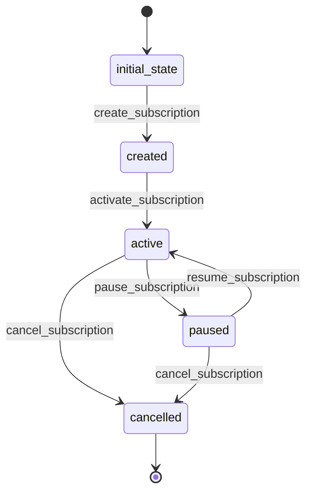

# WeatherSubscription Workflow

## States
- **initial_state**: Starting point
- **created**: Subscription created but not validated
- **active**: Subscription is active and generating notifications
- **paused**: Subscription temporarily disabled
- **cancelled**: Subscription permanently disabled

## Transitions

### initial_state → created
- **Name**: create_subscription
- **Type**: Automatic
- **Processor**: CreateSubscriptionProcessor
- **Description**: Creates new weather subscription

### created → active
- **Name**: activate_subscription
- **Type**: Manual
- **Processor**: ActivateSubscriptionProcessor
- **Criteria**: ValidLocationCriteria
- **Description**: Activates subscription after location validation

### active → paused
- **Name**: pause_subscription
- **Type**: Manual
- **Processor**: PauseSubscriptionProcessor
- **Description**: Temporarily pauses subscription

### paused → active
- **Name**: resume_subscription
- **Type**: Manual
- **Processor**: ResumeSubscriptionProcessor
- **Description**: Resumes paused subscription

### active → cancelled
- **Name**: cancel_subscription
- **Type**: Manual
- **Processor**: CancelSubscriptionProcessor
- **Description**: Permanently cancels subscription

### paused → cancelled
- **Name**: cancel_subscription
- **Type**: Manual
- **Processor**: CancelSubscriptionProcessor
- **Description**: Permanently cancels paused subscription

## Mermaid State Diagram


## Processors

### CreateSubscriptionProcessor
- **Entity**: WeatherSubscription
- **Input**: Subscription data (user_id, location, coordinates)
- **Purpose**: Create new weather subscription
- **Output**: WeatherSubscription entity with created state
- **Pseudocode**:
```
process(entity):
    validate_user_exists(entity.user_id)
    validate_coordinates(entity.latitude, entity.longitude)
    entity.active = false
    entity.meta.state = "created"
    return entity
```

### ActivateSubscriptionProcessor
- **Entity**: WeatherSubscription
- **Input**: WeatherSubscription entity
- **Purpose**: Activate subscription for notifications
- **Output**: WeatherSubscription entity with active state
- **Pseudocode**:
```
process(entity):
    entity.active = true
    entity.meta.state = "active"
    schedule_weather_fetch(entity)
    return entity
```

### PauseSubscriptionProcessor
- **Entity**: WeatherSubscription
- **Input**: WeatherSubscription entity
- **Purpose**: Temporarily pause subscription
- **Output**: WeatherSubscription entity with paused state
- **Pseudocode**:
```
process(entity):
    entity.active = false
    entity.meta.state = "paused"
    unschedule_weather_fetch(entity)
    return entity
```

### ResumeSubscriptionProcessor
- **Entity**: WeatherSubscription
- **Input**: WeatherSubscription entity
- **Purpose**: Resume paused subscription
- **Output**: WeatherSubscription entity with active state
- **Pseudocode**:
```
process(entity):
    entity.active = true
    entity.meta.state = "active"
    schedule_weather_fetch(entity)
    return entity
```

### CancelSubscriptionProcessor
- **Entity**: WeatherSubscription
- **Input**: WeatherSubscription entity
- **Purpose**: Permanently cancel subscription
- **Output**: WeatherSubscription entity with cancelled state
- **Pseudocode**:
```
process(entity):
    entity.active = false
    entity.meta.state = "cancelled"
    unschedule_weather_fetch(entity)
    return entity
```

## Criteria

### ValidLocationCriteria
- **Purpose**: Validate location coordinates are within valid ranges
- **Pseudocode**:
```
check(entity):
    if entity.latitude < -90 or entity.latitude > 90:
        return false
    if entity.longitude < -180 or entity.longitude > 180:
        return false
    return true
```
