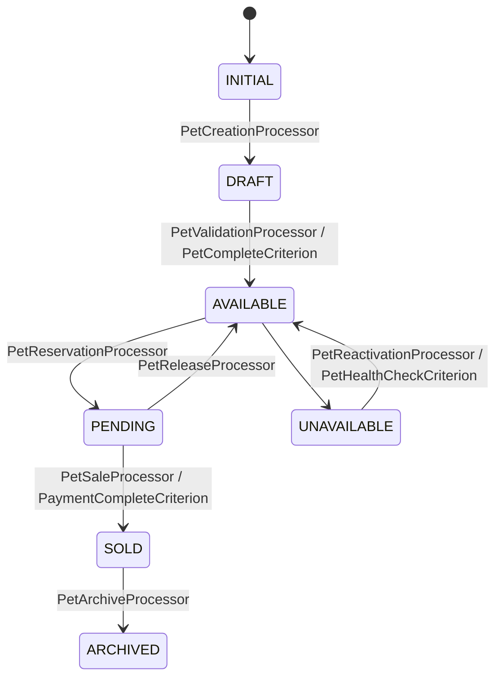
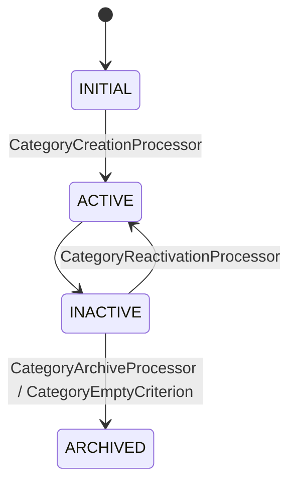
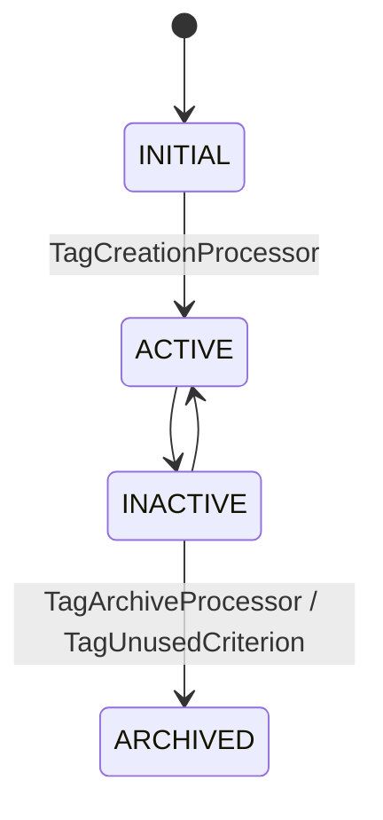
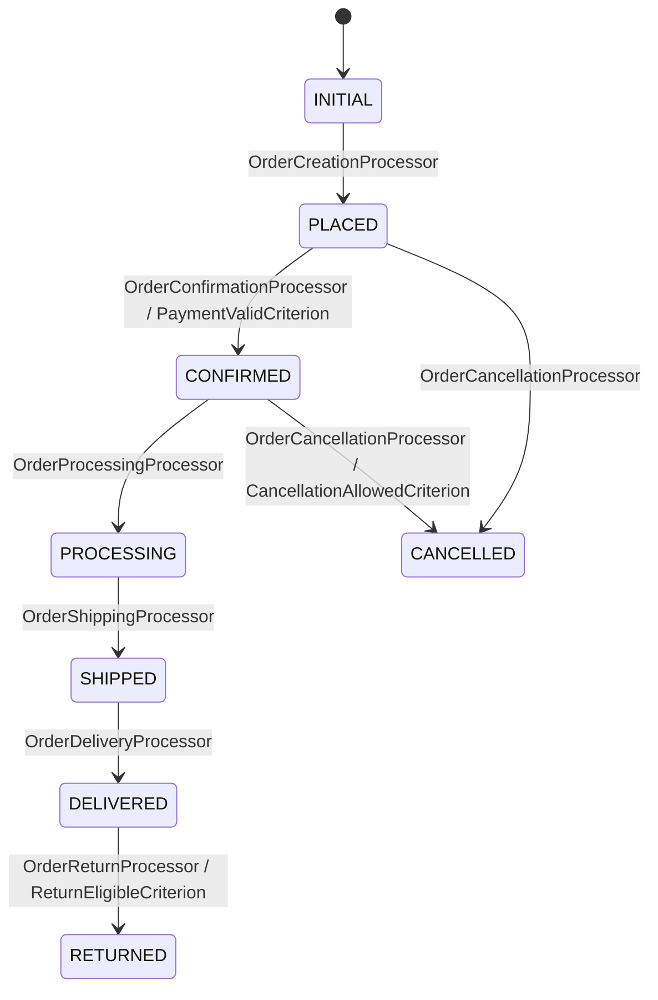
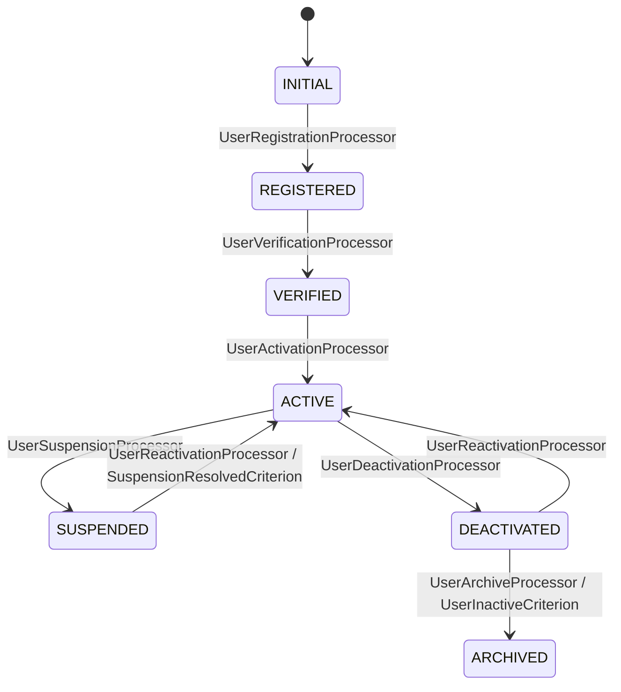

# Purrfect Pets - Workflow Requirements

## Overview
This document defines the workflows for each entity in the Purrfect Pets API application, including states, transitions, processors, and criteria.

## 1. Pet Workflow

### States
- `INITIAL` - Starting state for new pets
- `DRAFT` - Pet information is being prepared
- `AVAILABLE` - Pet is available for adoption/purchase
- `PENDING` - Pet has a pending adoption/purchase
- `SOLD` - Pet has been sold/adopted
- `UNAVAILABLE` - Pet is temporarily unavailable
- `ARCHIVED` - Pet record is archived

### Transitions
1. `INITIAL` → `DRAFT` (Automatic)
   - Processor: `PetCreationProcessor`
   - Criterion: None

2. `DRAFT` → `AVAILABLE` (Manual)
   - Processor: `PetValidationProcessor`
   - Criterion: `PetCompleteCriterion`

3. `AVAILABLE` → `PENDING` (Automatic)
   - Processor: `PetReservationProcessor`
   - Criterion: None

4. `PENDING` → `SOLD` (Manual)
   - Processor: `PetSaleProcessor`
   - Criterion: `PaymentCompleteCriterion`

5. `PENDING` → `AVAILABLE` (Manual)
   - Processor: `PetReleaseProcessor`
   - Criterion: None

6. `AVAILABLE` → `UNAVAILABLE` (Manual)
   - Processor: None
   - Criterion: None

7. `UNAVAILABLE` → `AVAILABLE` (Manual)
   - Processor: `PetReactivationProcessor`
   - Criterion: `PetHealthCheckCriterion`

8. `SOLD` → `ARCHIVED` (Manual)
   - Processor: `PetArchiveProcessor`
   - Criterion: None

### Mermaid Diagram

## 2. Category Workflow

### States
- `INITIAL` - Starting state for new categories
- `ACTIVE` - Category is active and can be used
- `INACTIVE` - Category is inactive but not deleted
- `ARCHIVED` - Category is archived

### Transitions
1. `INITIAL` → `ACTIVE` (Automatic)
   - Processor: `CategoryCreationProcessor`
   - Criterion: None

2. `ACTIVE` → `INACTIVE` (Manual)
   - Processor: None
   - Criterion: None

3. `INACTIVE` → `ACTIVE` (Manual)
   - Processor: `CategoryReactivationProcessor`
   - Criterion: None

4. `INACTIVE` → `ARCHIVED` (Manual)
   - Processor: `CategoryArchiveProcessor`
   - Criterion: `CategoryEmptyCriterion`

### Mermaid Diagram

## 3. Tag Workflow

### States
- `INITIAL` - Starting state for new tags
- `ACTIVE` - Tag is active and can be used
- `INACTIVE` - Tag is inactive but not deleted
- `ARCHIVED` - Tag is archived

### Transitions
1. `INITIAL` → `ACTIVE` (Automatic)
   - Processor: `TagCreationProcessor`
   - Criterion: None

2. `ACTIVE` → `INACTIVE` (Manual)
   - Processor: None
   - Criterion: None

3. `INACTIVE` → `ACTIVE` (Manual)
   - Processor: None
   - Criterion: None

4. `INACTIVE` → `ARCHIVED` (Manual)
   - Processor: `TagArchiveProcessor`
   - Criterion: `TagUnusedCriterion`

### Mermaid Diagram

## 4. Order Workflow

### States
- `INITIAL` - Starting state for new orders
- `PLACED` - Order has been placed
- `CONFIRMED` - Order has been confirmed
- `PROCESSING` - Order is being processed
- `SHIPPED` - Order has been shipped
- `DELIVERED` - Order has been delivered
- `CANCELLED` - Order has been cancelled
- `RETURNED` - Order has been returned

### Transitions
1. `INITIAL` → `PLACED` (Automatic)
   - Processor: `OrderCreationProcessor`
   - Criterion: None

2. `PLACED` → `CONFIRMED` (Automatic)
   - Processor: `OrderConfirmationProcessor`
   - Criterion: `PaymentValidCriterion`

3. `CONFIRMED` → `PROCESSING` (Manual)
   - Processor: `OrderProcessingProcessor`
   - Criterion: None

4. `PROCESSING` → `SHIPPED` (Manual)
   - Processor: `OrderShippingProcessor`
   - Criterion: None

5. `SHIPPED` → `DELIVERED` (Manual)
   - Processor: `OrderDeliveryProcessor`
   - Criterion: None

6. `PLACED` → `CANCELLED` (Manual)
   - Processor: `OrderCancellationProcessor`
   - Criterion: None

7. `CONFIRMED` → `CANCELLED` (Manual)
   - Processor: `OrderCancellationProcessor`
   - Criterion: `CancellationAllowedCriterion`

8. `DELIVERED` → `RETURNED` (Manual)
   - Processor: `OrderReturnProcessor`
   - Criterion: `ReturnEligibleCriterion`

### Mermaid Diagram

## 5. User Workflow

### States
- `INITIAL` - Starting state for new users
- `REGISTERED` - User has registered but not verified
- `VERIFIED` - User email has been verified
- `ACTIVE` - User account is active
- `SUSPENDED` - User account is suspended
- `DEACTIVATED` - User account is deactivated
- `ARCHIVED` - User account is archived

### Transitions
1. `INITIAL` → `REGISTERED` (Automatic)
   - Processor: `UserRegistrationProcessor`
   - Criterion: None

2. `REGISTERED` → `VERIFIED` (Manual)
   - Processor: `UserVerificationProcessor`
   - Criterion: None

3. `VERIFIED` → `ACTIVE` (Automatic)
   - Processor: `UserActivationProcessor`
   - Criterion: None

4. `ACTIVE` → `SUSPENDED` (Manual)
   - Processor: `UserSuspensionProcessor`
   - Criterion: None

5. `SUSPENDED` → `ACTIVE` (Manual)
   - Processor: `UserReactivationProcessor`
   - Criterion: `SuspensionResolvedCriterion`

6. `ACTIVE` → `DEACTIVATED` (Manual)
   - Processor: `UserDeactivationProcessor`
   - Criterion: None

7. `DEACTIVATED` → `ACTIVE` (Manual)
   - Processor: `UserReactivationProcessor`
   - Criterion: None

8. `DEACTIVATED` → `ARCHIVED` (Manual)
   - Processor: `UserArchiveProcessor`
   - Criterion: `UserInactiveCriterion`

### Mermaid Diagram

## Workflow Notes

1. **Automatic Transitions**: First transitions from INITIAL state are always automatic and triggered when an entity is created.

2. **Manual Transitions**: All other transitions require explicit API calls with transition names.

3. **Loop Transitions**: Transitions that go back to previous states or loop to the same state are marked as manual.

4. **Processors**: Handle business logic during transitions. Can modify entity data, call external services, or perform validations.

5. **Criteria**: Provide conditional logic to determine if a transition should be allowed based on current entity state or external conditions.
